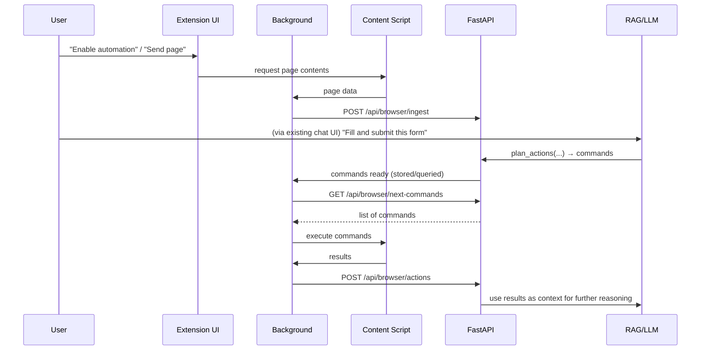

# Browser Integration & Automation Design

> Enable the Local AI Assistant to access **logged‑in, rendered browser content** and perform **controlled browser automations**, while keeping all data local and privacy‑preserving.

---
## Feature Overview

This document describes a **feature-level design** for browser integration and automation. It is **not** a project phase by itself, but a capability that can be implemented within future phases.

---

## 1. Purpose & Scope

- **Goal**  
  Allow the Local AI Assistant to:
  - **Read** what the user sees in a browser tab (including logged‑in / account‑based pages).
  - **Perform controlled automations** in that tab (click, type, navigate, etc.).
- **Constraints**  
  - All processing remains **local** on the user’s machine.
  - No automatic spying on tabs; all actions must be **explicitly triggered** and **visible**.
  - Integrates with existing **FastAPI + RAG + Ollama** stack.

- **Out of scope (initially)**  
  - Cloud-based automation.  
  - Full cross-browser support (start with Chromium-based browsers).  
  - Long‑running, fully autonomous “agent that roams the web” (MVP is task‑scoped automations).

---

## 2. Target Use Cases

- **[read-1] Capture logged‑in app state**  
  As a user, I want to **send the current page content** (DOM / visible text) of a logged‑in web app to my local AI so that it can answer questions using exactly what I see.

- **[read-2] Structured extraction**  
  As a user, I want the assistant to **extract structured data** from pages (tables, lists, cards) and summarize or transform it.

- **[auto-1] Simple UI workflows**  
  As a user, I want to ask:  
  “Open settings, change option X to Y, and save”  
  and have the assistant perform a **short, deterministic sequence** of UI actions.

- **[auto-2] Form filling**  
  As a user, I want the assistant to **fill in forms** (e.g., tickets, reports, emails) using context from my documents/code and my instructions.

- **[auto-3] Repeated micro‑tasks**  
  As a user, I want to define a **small workflow** (e.g., “for each row in this table, open details and copy a field”) and have the assistant execute it with my approval.

---

## 3. High‑Level Architecture

```mermaid
flowchart LR
  subgraph Browser["Browser (Chrome/Brave, etc.)"]
    CS[Content Script<br/>(per tab)]
    BG[Background/Service Worker]
    UI[Extension UI<br/>(popup/options)]
  end

  subgraph LocalAPI["Local AI Backend (FastAPI)"]
    API[Automation & Ingest API]
    RAG[RAG + Tools<br/>(LLM, ChromaDB)]
  end

  CS <--> BG
  BG <--> API
  API <--> RAG

  CS -->|Capture DOM / Perform actions| Page[(Web Page)]
```

- **Content Script**  
  Lives in the page context.  
  Reads visible content and performs DOM-based actions (click, type, etc.).

- **Background / Service Worker**  
  Central message router inside the extension.  
  Maintains a connection to the local backend.  
  Provides a stable identity across tabs.

- **Local FastAPI Backend**  
  New endpoints for:
  - Ingesting page content.  
  - Sending back **automation commands**.  
  Uses existing RAG + LLM tools to:  
  - Interpret pages.  
  - Plan action sequences.

---

## 4. Components

### 4.1 Browser Extension

- **Manifest**  
  - WebExtension Manifest v3.  
  - Intended browsers: Chrome/Brave (later: Firefox, Edge).  
  - Permissions (MVP):  
    - `activeTab`  
    - `scripting`  
    - `tabs`  
    - Optional: limited host permissions (`https://target.app/*`).

- **Content Script**  
  - **Responsibilities**:  
    - Capture:  
      - Full page text: `document.body.innerText`.  
      - Optional HTML: `document.documentElement.outerHTML`.  
      - Optional selected text / elements.  
    - Execute actions:  
      - Click element by CSS selector or XPath.  
      - Type into inputs.  
      - Scroll to elements.  
      - Navigate via `window.location` when instructed.  
    - Return **results** and **errors** to the background worker.

- **Background / Service Worker**  
  - **Responsibilities**:  
    - Maintain connection with FastAPI backend:  
      - Polling (MVP): periodic `GET /api/automation/next-task`.  
      - Later: WebSocket for push actions.  
    - Route messages:  
      - From popup/UI → content script.  
      - From backend → content script (actions).  
      - From content script → backend (page data, results).

- **Extension UI (popup + options page)**  
  - **Capabilities**:  
    - Button: “Send current tab to Local AI Assistant”.  
    - Button: “Enable automation on this tab”.  
    - Status indicator (Idle / Connected / Executing).  
    - Minimal settings: backend URL (`http://127.0.0.1:8100`).

---

### 4.2 Local AI Backend (FastAPI)

New logical module: `browser_integration` (name TBD).

- **Key Endpoints (MVP)**

  - **`POST /api/browser/ingest`**  
    - **Purpose**: Receive page content from the extension.  
    - **Payload** (example):
      ```json
      {
        "tab_id": "string",
        "url": "https://app.example.com/path",
        "title": "Page Title",
        "html": "<html>...</html>",
        "text": "Visible text...",
        "timestamp": "2025-11-26T21:30:00Z"
      }
      ```
    - **Behavior**:  
      - Clean and chunk content.  
      - Ingest into ChromaDB with metadata:  
        - `source_type="browser"`  
        - `tab_id`, `url`, `timestamp`.  
      - Optionally store a short‑lived “session index” separate from long‑term corpus.

  - **`POST /api/browser/actions`**  
    - **Purpose**: Receive **results** of executed actions from the extension.  
    - **Payload**:
      ```json
      {
        "tab_id": "string",
        "actions": [
          {
            "id": "action-1",
            "type": "click",
            "selector": "#submit",
            "status": "success",
            "error": null
          }
        ]
      }
      ```
    - **Behavior**:  
      - Log results.  
      - Optionally feed back into the LLM as context for next steps.

  - **`GET /api/browser/next-commands?tab_id=...`** (MVP pull model)  
    - **Purpose**: Let extension **pull** pending automation commands.  
    - **Response example**:
      ```json
      {
        "commands": [
          {
            "id": "cmd-1",
            "type": "click",
            "selector": "#submit",
            "timeout_ms": 5000
          }
        ]
      }
      ```
    - **Behavior**:  
      - Returns a small batch of commands queued by the assistant.  
      - Empty list if no commands pending.

- **LLM / Tooling**  
  - New **tools/agents**:  
    - `read_page(tab_id, url)` → fetch recent `browser` documents from Chroma.  
    - `plan_actions(goal, page_state)` → return a list of structured commands.  
  - Reuse existing:  
    - RAG retrieval.  
    - Agent/tool architecture (Phase 2).

---

## 5. Command & Data Model

### 5.1 Command Types (MVP)

- **`open_url`**  
  - Fields: `url`.  
  - Effect: navigate current tab to URL.

- **`click`**  
  - Fields: `selector`, optional `strategy` (css/xpath/text), `timeout_ms`.  
  - Effect: find and click a DOM element.

- **`type_text`**  
  - Fields: `selector`, `text`, `clear_first` (bool).  
  - Effect: focus element, optionally clear, then type text.

- **`wait_for`**  
  - Fields: `selector`, `timeout_ms`.  
  - Effect: wait until element appears or timeout.

- **`read_text`**  
  - Fields: `selector`, `max_chars`.  
  - Effect: read and return text content of element(s).

### 5.2 Command Lifecycle



---

## 6. Functional Requirements

### 6.1 Content Capture

- **[FR-1] Manual capture**  
  - User can trigger “Send current tab to Local AI Assistant” from the extension UI.  
  - Extension captures:  
    - URL, title, timestamp.  
    - Visible text (required).  
    - Optionally full HTML.

- **[FR-2] Session association**  
  - Backend associates captured content with:  
    - `tab_id`  
    - One or more assistant conversations (e.g., via conversation ID).  
  - Assistant can answer questions about the **latest snapshot** for that tab.

- **[FR-3] Incremental snapshots (optional, later)**  
  - User can re‑capture updated page state.  
  - Backend treats new snapshot as a new document version.

### 6.2 Automation

- **[FR-4] Explicit enablement**  
  - Automation is **disabled by default** on all tabs.  
  - User must click “Enable automation on this tab” in the extension UI.  
  - Visible indication (icon badge / banner) when automation is active.

- **[FR-5] Command execution**  
  - Once enabled:  
    - Extension periodically polls for commands for `tab_id`.  
    - Executes them sequentially in the content script.  
  - Each command returns:  
    - `status` (`success`, `failed`, `timeout`, `not_found`).  
    - `error` message if any.  
    - Optional `data` (e.g., text read).

- **[FR-6] Safety bounds**  
  - Hard limits:  
    - Max commands per “run” (e.g., 20).  
    - Command timeout per step.  
  - If limits are hit:  
    - Extension stops and reports an error.  
    - Assistant must ask user before continuing.

- **[FR-7] User confirmation for destructive actions (later)**  
  - For high‑risk operations (e.g., `click` on “Delete”, navigation away with unsaved changes):  
    - Extension shows a confirmation dialog before executing.

### 6.3 Assistant Integration

- **[FR-8] Goal‑based instructions**  
  - In the chat UI, user can write high‑level goals:  
    - “Fill this bug report form using the last error message I pasted.”  
  - Assistant uses tools:  
    - Fetch latest page snapshot for that tab.  
    - Plan structured commands.  
    - Queue them for execution.

- **[FR-9] Step‑by‑step explanation**  
  - Assistant explains planned actions in natural language:  
    - “I will: 1) type in the title, 2) select severity, 3) click ‘Submit’.”  
  - User can approve or cancel the run.

---

## 7. Security, Privacy, and UX Principles

- **[SEC-1] No background scraping**  
  - Extension never sends tab content automatically without user action.  
  - No periodic or hidden capture of arbitrary tabs.

- **[SEC-2] Local‑only communication**  
  - Extension communicates only with:  
    - `http://127.0.0.1:<configured_port>`  
  - No external endpoints without explicit configuration.

- **[SEC-3] Minimal permissions**  
  - Use `activeTab` and/or targeted host permissions.  
  - Avoid `<all_urls>` where possible.

- **[SEC-4] Visibility**  
  - When automation is active on a tab:  
    - Icon badge or small in‑page overlay indicates status.  
    - User can stop automation immediately from the extension UI.

- **[SEC-5] Data retention**  
  - Browser snapshots are:  
    - Either short‑lived (session index) or tagged clearly in Chroma.  
    - Subject to a configurable retention policy.

---

## 8. MVP Scope & Phasing

### Phase A – Content Capture Only

- **Backend**  
  - Implement `POST /api/browser/ingest`.  
  - Integrate with existing RAG pipeline.
- **Extension**  
  - Capture visible text + metadata.  
  - Manual “Send page to assistant” button.

### Phase B – Basic Automation

- **Backend**  
  - Define command schema.  
  - Implement `GET /api/browser/next-commands` and `POST /api/browser/actions`.  
  - Simple “task planner” tool that converts user instruction → small command list.
- **Extension**  
  - Implement execution of `open_url`, `click`, `type_text`, `wait_for`, `read_text`.  
  - Status reporting + error handling.

### Phase C – Safety + UX Enhancements

- Confirmation prompts for risky actions.
- Better visual indication in the page.
- Higher‑level workflows (loops, conditionals) and richer planning.

---

## 9. Open Questions

- **[Q1] Browser targets**  
  - Start with Chrome/Brave only, or also plan Firefox from day one?

- **[Q2] Session vs global index**  
  - Should browser content go to:  
    - A **separate, ephemeral index** (per session)?  
    - Or integrated into the global knowledge base with tags?

- **[Q3] Long‑running automations**  
  - Do we support multi‑minute workflows that may span navigation to several domains?

- **[Q4] Per‑domain policies**  
  - Allow user to define:  
    - “Never capture/automate on domain X.”  
    - “Always require extra confirmation on domain Y.”

---

**Summary**  
This document defines the requirements and architecture for a **privacy‑preserving browser extension** that integrates with your Local AI Assistant to:

- Capture logged‑in, rendered page content.  
- Execute controlled UI automations driven by your existing RAG + agent framework.
