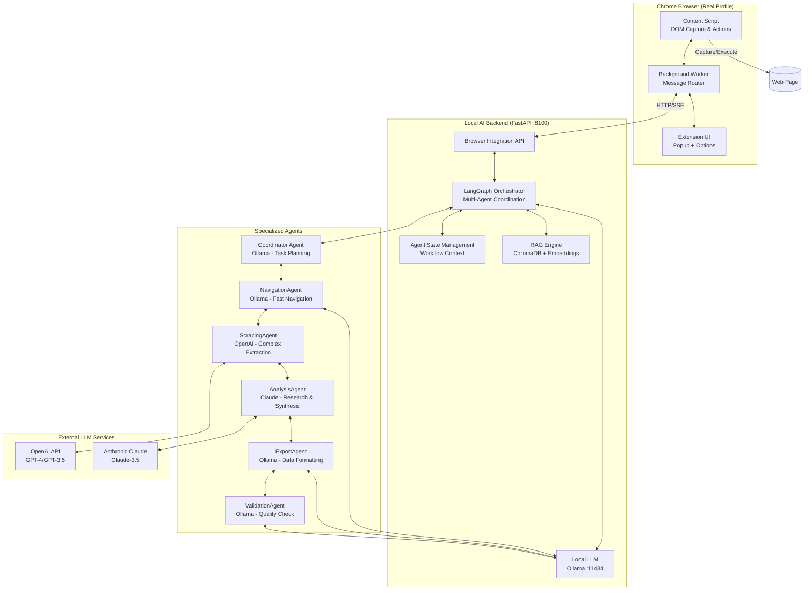
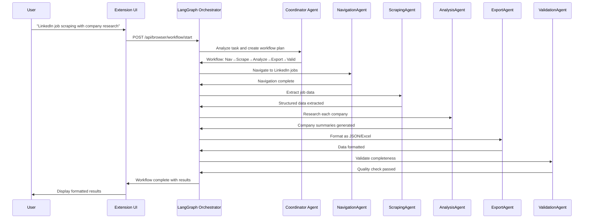
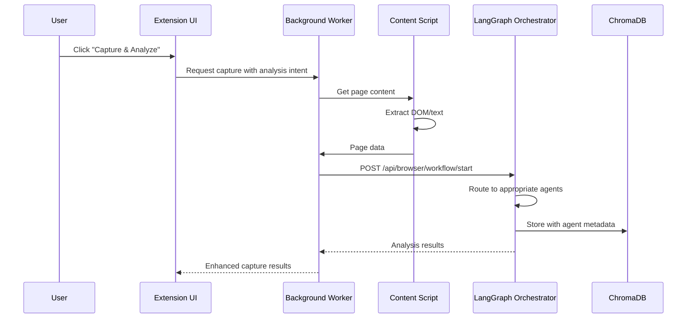
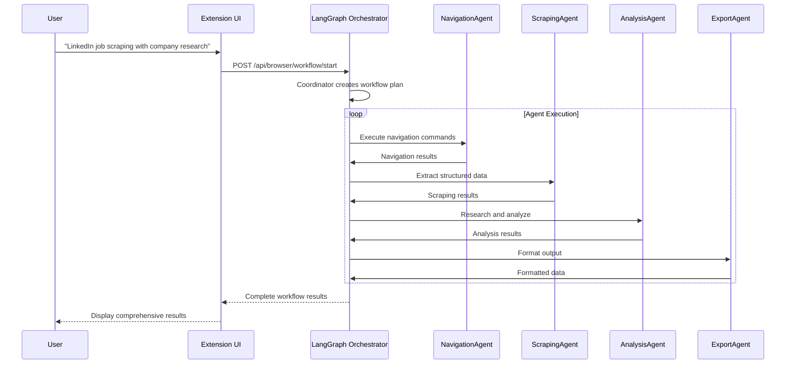

# Chrome Extension — Complete Specification & Implementation Guide

> **LocalAgent Chrome Extension**: A privacy-first browser automation and content extraction system that integrates with the Local AI Assistant's FastAPI + RAG + Ollama stack.

---

## Table of Contents

1. [Executive Summary](#1-executive-summary)
2. [Vision & Goals](#2-vision--goals)
3. [Target Use Cases](#3-target-use-cases)
4. [System Architecture](#4-system-architecture)
5. [Requirements](#5-requirements)
6. [Component Specifications](#6-component-specifications)
7. [API Endpoints](#7-api-endpoints)
8. [Command & Data Models](#8-command--data-models)
9. [Security & Privacy](#9-security--privacy)
10. [Implementation Plan](#10-implementation-plan)
11. [Folder Structure](#11-folder-structure)
12. [Testing & Validation](#12-testing--validation)
13. [Risks & Mitigations](#13-risks--mitigations)
14. [Deliverables Checklist](#14-deliverables-checklist)

---

## 1. Executive Summary

Build a **privacy-preserving Chrome extension** that:

- **Captures** logged-in, rendered browser content and sends it to the local RAG system
- **Executes** controlled UI automations driven by natural language instructions
- **Records** and replays workflows for repetitive tasks
- **Integrates** seamlessly with the existing FastAPI + ChromaDB + Ollama stack
- **Operates** entirely locally with zero external data transmission

**Primary Users**: Power users, security-conscious professionals, researchers, productivity enthusiasts.

---

## 2. Vision & Goals

### 2.1 Vision Statement

Create a system that runs entirely on the user's machine, controls the real Chrome browser via a Manifest V3 extension, and uses the local FastAPI agent to orchestrate tasks via Ollama LLM for reasoning, selector inference, and memory.

### 2.2 Goals

| Goal | Description |
|------|-------------|
| **Privacy-First** | All data stays local; no external cloud by default |
| **Session-Aware** | Leverage user's real Chrome profile cookies & sessions |
| **AI-Powered** | Use local LLM for intelligent automation planning |
| **Human-Like** | Simulate natural user behavior (typing delays, mouse movements) |
| **Extensible** | Support workflow recording, playback, and sharing |

### 2.3 Constraints

- All processing remains **local** on user's machine
- No automatic/hidden scraping; actions must be **explicitly triggered**
- Integrates with existing **FastAPI + RAG + Ollama** stack (port 8100)
- Start with **Chromium-based browsers** (Chrome, Brave, Edge)
- MVP focuses on **task-scoped automations** (not autonomous web roaming)

### 2.4 Out of Scope (Initially)

- Cloud-based automation services
- Full cross-browser support (Firefox planned for later)
- Long-running autonomous agents
- CAPTCHA solving or anti-bot bypass

---

## 3. Target Use Cases

### 3.1 Content Capture

| ID | Use Case | Description |
|----|----------|-------------|
| **UC-READ-1** | Capture Logged-In State | Send current page content (DOM/visible text) of a logged-in web app to local AI for Q&A |
| **UC-READ-2** | Structured Extraction | Extract tables, lists, cards from pages; summarize or transform data |
| **UC-READ-3** | Session Snapshots | Take incremental snapshots of page state for comparison |

### 3.2 Automation

| ID | Use Case | Description |
|----|----------|-------------|
| **UC-AUTO-1** | Simple UI Workflows | "Open settings, change option X to Y, and save" |
| **UC-AUTO-2** | Form Filling | Fill forms using context from documents/code and instructions |
| **UC-AUTO-3** | Repeated Micro-Tasks | "For each row in this table, open details and copy a field" |
| **UC-AUTO-4** | Data Export | "Download last month's invoices from Acme Portal" |

### 3.3 Workflow Management

| ID | Use Case | Description |
|----|----------|-------------|
| **UC-WF-1** | Record Workflow | Record user actions for later replay |
| **UC-WF-2** | Playback Workflow | Execute saved workflows with optional modifications |
| **UC-WF-3** | Share Workflows | Export/import encrypted workflow definitions |

### 3.4 Advanced Use Cases (Phase 5+)

| ID | Use Case | Description | Required Features |
|----|----------|-------------|------------------|
| **UC-ADV-1** | LinkedIn Job Scraping | "Go to LinkedIn jobs, search for machine learning engineer and scrape job titles, company, location, etc. Then research each company and add summaries to Excel" | Multi-page workflows, Excel export, Iterative processing, Autonomous execution |
| **UC-ADV-2** | Amazon Product Search | "Search for Yamaha keyboard in current tab and give me the best options" | In-chat result formatting, Product comparison, Ranking logic, Structured data extraction |
| **UC-ADV-3** | E-commerce Price Monitoring | "Track prices of products across multiple sites and alert when they drop below threshold" | Cross-site workflows, Data persistence, Scheduled execution, Notification system |
| **UC-ADV-4** | Research Report Generation | "Extract data from 10 research papers, summarize findings, and compile into a structured report" | Batch processing, Document analysis, Report generation, Data synthesis |

#### Feature Dependency Matrix

| Advanced Use Case | Phase 2 Automation | Phase 4 Workflows | Phase 5+ Data Export | Phase 5+ Iteration | Phase 5+ Autonomous |
|-------------------|-------------------|------------------|---------------------|-------------------|-------------------|
| LinkedIn Job Scraping | ✅ | ❌ | ❌ | ❌ | ❌ |
| Amazon Product Search | ✅ | 🚧 | 🚧 | ❌ | ❌ |
| Price Monitoring | ✅ | ❌ | ❌ | ❌ | ❌ |
| Research Reports | ✅ | ❌ | ❌ | ❌ | ❌ |

**Implementation Complexity:** High - These use cases require 3-4 additional development phases beyond current MVP capabilities.

---

## 4. System Architecture

### 4.1 High-Level Multi-Agent Architecture



### 4.2 Component Responsibilities

| Component | Responsibility | LLM Provider |
|-----------|----------------|--------------|
| **Coordinator Agent** | Task decomposition, workflow planning, agent coordination | Ollama (Local) |
| **NavigationAgent** | Page navigation, form filling, clicking, scrolling | Ollama (Local) |
| **ScrapingAgent** | Complex data extraction, table parsing, structured data | OpenAI (External) |
| **AnalysisAgent** | Company research, content analysis, synthesis | Claude (External) |
| **ExportAgent** | JSON/Excel formatting, data structuring | Ollama (Local) |
| **ValidationAgent** | Data validation, quality checks, completeness verification | Ollama (Local) |
| **LangGraph Orchestrator** | Agent workflow management, state synchronization, error recovery | - |
| **Chrome Extension** | DOM capture, command execution, user interface | - |

### 4.3 Agent Coordination Flow



### 4.4 Multi-Agent Coordination

#### Agent State Management
The LangGraph orchestrator maintains workflow state across agent execution:

```python
class WorkflowState:
    task: str                    # Original user instruction
    current_url: str            # Current browser page
    extracted_data: List[Dict]  # Data collected by agents
    analysis_results: List[Dict] # Analysis from external LLMs
    formatted_output: Dict      # Final formatted results
    errors: List[str]           # Agent execution errors
    agent_results: Dict[str, Any] # Individual agent outputs
    workflow_step: str          # Current agent in execution
    cost_tracking: Dict[str, float] # LLM costs per agent
```

#### Agent Handoff Patterns
- **Sequential Handoff**: Navigation → Scraping → Analysis → Export → Validation
- **Conditional Branching**: Based on data completeness or user preferences
- **Error Recovery**: Individual agent retries without full workflow restart
- **Parallel Execution**: Multiple analysis agents for different data types

#### Data Anonymization Pipeline
Before sending data to external LLMs (OpenAI, Claude):

**Level 1 (Basic):**
```python
def basic_anonymize(dom_data: dict) -> dict:
    # Remove personal identifiers
    # Strip sensitive URLs
    # Sanitize user input fields
    # Preserve DOM structure for selectors
```

**Level 2 (Advanced):**
```python
def advanced_anonymize(dom_data: dict) -> dict:
    # Genericize CSS selectors
    # Replace brand names with generic terms
    # Maintain hierarchical structure
    # Preserve interactive elements
```

### 4.5 Data Flow: Content Capture (Multi-Agent)



### 4.6 Data Flow: Multi-Agent Automation



---

## 5. Requirements

### 5.1 Functional Requirements

#### Content Capture (P0 = Must Have, P1 = Should Have, P2 = Nice to Have)

| ID | Requirement | Priority |
|----|-------------|----------|
| **FR-CAP-1** | Manual capture via "Send to AI" button | P0 |
| **FR-CAP-2** | Capture URL, title, timestamp, visible text | P0 |
| **FR-CAP-3** | Optional full HTML capture | P1 |
| **FR-CAP-4** | Selected text/element capture | P1 |
| **FR-CAP-5** | Associate content with tab_id and conversation | P0 |
| **FR-CAP-6** | Incremental snapshot support | P2 |

#### Automation

| ID | Requirement | Priority |
|----|-------------|----------|
| **FR-AUTO-1** | Explicit enablement per tab (disabled by default) | P0 |
| **FR-AUTO-2** | Visual indicator when automation active | P0 |
| **FR-AUTO-3** | Execute: click, type, wait, scroll, read, navigate | P0 |
| **FR-AUTO-4** | Command timeout per step (default 5s) | P0 |
| **FR-AUTO-5** | Max commands per run (safety limit: 20) | P0 |
| **FR-AUTO-6** | Return status: success/failed/timeout/not_found | P0 |
| **FR-AUTO-7** | Confirmation for destructive actions | P1 |
| **FR-AUTO-8** | Human-like typing delays and timing | P1 |

#### Workflow Management

| ID | Requirement | Priority |
|----|-------------|----------|
| **FR-WF-1** | Record user actions in current tab | P1 |
| **FR-WF-2** | Playback recorded workflows | P1 |
| **FR-WF-3** | Export workflows as encrypted JSON | P2 |
| **FR-WF-4** | Import workflows from file | P2 |

#### Assistant Integration

| ID | Requirement | Priority |
|----|-------------|----------|
| **FR-AI-1** | Accept natural language goals in chat UI | P0 |
| **FR-AI-2** | Generate structured command plans | P0 |
| **FR-AI-3** | Explain planned actions before execution | P0 |
| **FR-AI-4** | User approval before automated execution | P0 |
| **FR-AI-5** | Use RAG context for form filling | P1 |

### 5.2 Non-Functional Requirements

| ID | Requirement | Target |
|----|-------------|--------|
| **NFR-1** | Planning + roundtrip latency | < 5 seconds |
| **NFR-2** | Resource usage | Works on 8GB RAM laptop |
| **NFR-3** | Browser compatibility | Chrome, Brave, Edge |
| **NFR-4** | OS compatibility | macOS, Windows, Linux |
| **NFR-5** | Extension size | < 5MB unpacked |

### 5.3 Security Requirements

| ID | Requirement | Priority |
|----|-------------|----------|
| **SR-1** | No automatic/hidden tab scraping | P0 |
| **SR-2** | Communicate only with localhost (127.0.0.1) | P0 |
| **SR-3** | Minimal permissions (activeTab preferred) | P0 |
| **SR-4** | Master PIN for sensitive operations | P1 |
| **SR-5** | Encrypted local storage for secrets | P1 |
| **SR-6** | Configurable domain whitelist | P1 |
| **SR-7** | Append-only action audit log | P2 |
| **SR-8** | No telemetry or external analytics | P0 |

---

## 6. Component Specifications

### 6.1 Chrome Extension Manifest (MV3)

```json
{
  "manifest_version": 3,
  "name": "LocalAgent - AI Browser Assistant",
  "version": "1.0.0",
  "description": "Privacy-first browser automation powered by local AI",
  "permissions": ["storage", "activeTab", "scripting", "tabs"],
  "host_permissions": [
    "http://127.0.0.1:8100/*",
    "http://localhost:8100/*"
  ],
  "background": {
    "service_worker": "background/background.js",
    "type": "module"
  },
  "action": {
    "default_popup": "popup/popup.html",
    "default_icon": {
      "16": "icons/icon16.png",
      "48": "icons/icon48.png",
      "128": "icons/icon128.png"
    }
  },
  "options_page": "options/options.html",
  "icons": {
    "16": "icons/icon16.png",
    "48": "icons/icon48.png",
    "128": "icons/icon128.png"
  }
}
```

### 6.2 Content Script Capabilities

| Capability | Description |
|------------|-------------|
| **DOM Snapshot** | Extract `document.body.innerText` and optional HTML |
| **Element Selection** | Query by CSS selector, XPath, or text content |
| **Click Action** | Find and click elements with human-like delay |
| **Type Action** | Focus input, optionally clear, type with variable delays |
| **Scroll Action** | Scroll element into view or scroll by amount |
| **Wait Action** | Wait for element to appear with configurable timeout |
| **Read Action** | Extract text content from elements |
| **Screenshot** | Capture visible viewport (via background worker) |

### 6.3 Background Worker Responsibilities

| Responsibility | Description |
|----------------|-------------|
| **Connection Manager** | Maintain HTTP connection to FastAPI backend |
| **Message Router** | Route messages between popup, content script, and backend |
| **State Manager** | Track automation state per tab (enabled/disabled) |
| **Command Queue** | Queue and dispatch commands to content script |
| **Result Collector** | Collect and report execution results to backend |
| **Workflow Storage** | Save/load workflows from chrome.storage |

### 6.4 Extension UI Components

**Popup Features:**
- Quick capture button ("Send to AI")
- Automation toggle (enable/disable per tab)
- Status indicator (Idle/Connected/Executing)
- Recent actions list
- Settings shortcut

**Options Page Features:**
- Backend URL configuration (default: http://127.0.0.1:8100)
- Domain whitelist management
- Security settings (PIN setup)
- Workflow management (list, edit, delete)
- Action log viewer

---

## 7. API Endpoints (Multi-Agent Architecture)

### 7.1 Content Ingestion

**`POST /api/browser/ingest`** — Receive and index page content

```json
// Request
{
  "tab_id": "string",
  "url": "https://app.example.com/dashboard",
  "title": "Dashboard - Example App",
  "text": "Visible page text content...",
  "html": "<html>...</html>",
  "timestamp": "2025-11-27T14:30:00Z",
  "metadata": {
    "viewport_width": 1920,
    "viewport_height": 1080,
    "anonymization_level": 1
  }
}

// Response
{
  "success": true,
  "document_id": "browser_doc_abc123",
  "chunks_created": 5,
  "agent_ready": true
}
```

### 7.2 Multi-Agent Workflow Management

**`POST /api/browser/workflow/start`** — Start multi-agent workflow

```json
// Request
{
  "tab_id": "string",
  "instruction": "LinkedIn job scraping with company research",
  "dom_snapshot": "Simplified DOM...",
  "user_preferences": {
    "use_external_llms": true,
    "anonymization_level": "advanced",
    "export_format": "json",
    "cost_limit": 5.00,
    "dry_run_mode": true
  }
}

// Response
{
  "success": true,
  "workflow_id": "workflow_xyz789",
  "estimated_cost": 2.50,
  "estimated_duration": "3-5 minutes",
  "agent_sequence": ["navigation", "scraping", "analysis", "export", "validation"],
  "requires_confirmation": true,
  "anonymization_preview": {
    "original_dom_size": "45.2KB",
    "anonymized_dom_size": "38.7KB",
    "removed_elements": ["user_emails", "phone_numbers", "personal_identifiers"],
    "preserved_selectors": ["#job-listings", ".job-title", ".company-name"],
    "privacy_score": 0.92
  }
}
```

**`GET /api/browser/workflow/{workflow_id}/status`** — Get workflow execution status

```json
// Response
{
  "workflow_id": "workflow_xyz789",
  "status": "running", // "running", "completed", "failed", "paused"
  "current_agent": "scraping",
  "completed_agents": ["navigation"],
  "progress": {
    "total_steps": 5,
    "completed_steps": 1,
    "current_step_progress": 60
  },
  "cost_so_far": 0.85,
  "estimated_remaining_cost": 1.65,
  "results": {
    "navigation": {
      "pages_visited": 2,
      "searches_performed": 1
    }
  },
  "errors": []
}
```

**`POST /api/browser/workflow/{workflow_id}/confirm`** — Confirm workflow execution

```json
// Request
{
  "confirmed": true,
  "modifications": {
    "skip_analysis": false,
    "export_format": "excel"
  }
}
```

**`POST /api/browser/workflow/{workflow_id}/pause`** — Pause/resume workflow

**`POST /api/browser/workflow/{workflow_id}/cancel`** — Cancel workflow execution

### 7.3 Agent-Specific Endpoints

**`POST /api/browser/agent/navigation/execute`** — Navigation agent commands

```json
// Request
{
  "workflow_id": "workflow_xyz789",
  "commands": [
    {"type": "navigate", "url": "https://linkedin.com/jobs"},
    {"type": "type_text", "selector": "#search-input", "value": "machine learning engineer"},
    {"type": "click", "selector": "[data-test='search-button']"}
  ]
}
```

**`POST /api/browser/agent/scraping/extract`** — Scraping agent data extraction

```json
// Request
{
  "workflow_id": "workflow_xyz789",
  "extraction_config": {
    "data_types": ["job_title", "company", "location", "link"],
    "max_results": 50,
    "anonymize_before_llm": true
  }
}

// Response
{
  "extracted_data": [
    {
      "job_title": "Senior Machine Learning Engineer",
      "company": "TechCorp",
      "location": "San Francisco, CA",
      "link": "https://linkedin.com/jobs/view/123"
    }
  ],
  "extraction_metadata": {
    "total_results": 45,
    "extraction_time": "2.3s"
  }
}
```

**`POST /api/browser/agent/analysis/research`** — Analysis agent research

```json
// Request
{
  "workflow_id": "workflow_xyz789",
  "companies": ["TechCorp", "DataInc", "AIMLabs"],
  "research_type": "company_summary",
  "llm_provider": "claude"
}
```

### 7.4 External LLM Integration

**`POST /api/browser/llm/external/request`** — External LLM API proxy

```json
// Request
{
  "provider": "openai", // "openai", "claude"
  "model": "gpt-4",
  "messages": [
    {"role": "system", "content": "You are a web scraping expert..."},
    {"role": "user", "content": "Extract job listings from this DOM..."}
  ],
  "anonymized_data": {
    "dom_structure": "...",
    "context": "job_search"
  }
}

// Response
{
  "success": true,
  "response": {
    "content": "Extracted job data...",
    "usage": {
      "prompt_tokens": 1250,
      "completion_tokens": 890,
      "total_tokens": 2140
    },
    "cost": 0.0128
  }
}
```

### 7.5 Configuration Management

**`GET /api/browser/config/agents`** — Get agent configuration

```json
// Response
{
  "agents": {
    "navigation": {
      "llm_provider": "ollama",
      "model": "llama3.1",
      "enabled": true
    },
    "scraping": {
      "llm_provider": "openai",
      "model": "gpt-4",
      "enabled": true,
      "cost_per_request": 0.01
    },
    "analysis": {
      "llm_provider": "claude",
      "model": "claude-3.5-sonnet",
      "enabled": true,
      "cost_per_request": 0.015
    }
  },
  "external_llms_enabled": true,
  "anonymization_level": "advanced"
}
```

**`PUT /api/browser/config/agents`** — Update agent configuration

### 7.6 Service Status (Enhanced)

**`GET /api/browser/status`** — Get comprehensive service status

```json
// Response
{
  "status": "ready",
  "connected_tabs": 2,
  "active_workflows": 1,
  "pending_commands": 0,
  "agent_status": {
    "navigation": "idle",
    "scraping": "busy",
    "analysis": "idle",
    "export": "idle",
    "validation": "idle"
  },
  "external_llms": {
    "openai": "connected",
    "claude": "connected"
  },
  "cost_tracking": {
    "today_total": 2.45,
    "monthly_limit": 50.00,
    "remaining_budget": 47.55
  }
}
```

---

## 8. Command & Data Models

### 8.1 Command Types

| Type | Required Fields | Optional Fields | Description |
|------|-----------------|-----------------|-------------|
| `navigate` | `url` | — | Navigate tab to URL |
| `click` | `selector` | `strategy`, `timeout_ms` | Click element |
| `type_text` | `selector`, `value` | `clear_first`, `delay_ms` | Type into input |
| `wait_for` | `selector` | `timeout_ms`, `visible` | Wait for element |
| `read_text` | `selector` | `max_chars` | Read element text |
| `scroll` | — | `selector`, `x`, `y` | Scroll page/element |
| `screenshot` | — | `selector`, `full_page` | Capture screenshot |

### 8.2 Selector Strategies

| Strategy | Example | Description |
|----------|---------|-------------|
| `css` (default) | `#submit-btn` | CSS selector |
| `xpath` | `//button[@type='submit']` | XPath expression |
| `text` | `Submit Form` | Element containing text |
| `aria` | `button[aria-label='Submit']` | ARIA attributes |

### 8.3 Command Result Statuses

| Status | Description |
|--------|-------------|
| `success` | Command executed successfully |
| `failed` | Command failed (with error message) |
| `timeout` | Element not found within timeout |
| `not_found` | Selector matched no elements |

---

## 9. Security & Privacy

### 9.1 Core Principles

| Principle | Implementation |
|-----------|----------------|
| **Zero Trust Default** | No outbound connections except localhost |
| **Explicit Consent** | All captures/automations user-triggered |
| **Minimal Permissions** | Use activeTab, avoid <all_urls> |
| **Data Locality** | All data stays on user's machine |
| **Visibility** | Clear indicators when automation active |

### 9.2 Master PIN System

1. User sets master PIN on first use
2. PIN derives encryption key via PBKDF2 (100,000 iterations)
3. Salt stored in chrome.storage.local
4. PIN held in memory only; cleared on browser restart
5. Re-authentication required after 30 minutes idle

### 9.3 API Security

| Measure | Description |
|---------|-------------|
| **Localhost Only** | Backend binds to 127.0.0.1 only |
| **Origin Check** | Verify requests from extension origin |
| **CORS Restriction** | Allow only extension origin |
| **Rate Limiting** | Max 100 requests/minute |

### 9.5 External LLM Security & Privacy

| Risk | Mitigation Strategy |
|------|-------------------|
| **Data Leakage** | Advanced anonymization before external API calls, strip all PII, preserve only DOM structure needed for selectors |
| **API Key Exposure** | Encrypted storage in backend, rotation policies, per-provider key isolation |
| **Unauthorized Access** | Rate limiting per provider, API key quotas, request origin validation |
| **Data Retention** | Zero retention policy for external LLM requests, immediate deletion after response |
| **Cost Overruns** | Per-user budget limits, real-time cost tracking, automatic cutoffs |
| **Provider Lock-in** | Multi-provider support, fallback mechanisms, standardized interfaces |

#### API Key Management
```python
class ExternalLLMConfig:
    openai_api_key: str = Field(..., encrypted=True)
    claude_api_key: str = Field(..., encrypted=True)
    monthly_budget: float = Field(default=50.00)
    per_request_limit: float = Field(default=5.00)
    anonymization_level: int = Field(default=2)
```

#### Data Anonymization Rules
```python
ANONYMIZATION_RULES = {
    "remove_patterns": [
        r"\b\d{3}-\d{2}-\d{4}\b",  # SSN
        r"\b[A-Za-z0-9._%+-]+@[A-Za-z0-9.-]+\.[A-Z|a-z]{2,}\b",  # Email
        r"\b\d{3}[-.]?\d{3}[-.]?\d{4}\b"  # Phone
    ],
    "preserve_selectors": True,
    "genericize_brands": True,
    "maintain_dom_structure": True
}
```

### 9.6 Cost Management & Monitoring

#### Per-Agent Cost Tracking
| Agent | LLM Provider | Estimated Cost/Request | Daily Limit |
|-------|--------------|----------------------|-------------|
| NavigationAgent | Ollama | $0.00 | Unlimited |
| ScrapingAgent | OpenAI | $0.01-0.05 | 100 requests |
| AnalysisAgent | Claude | $0.02-0.08 | 50 requests |
| ExportAgent | Ollama | $0.00 | Unlimited |
| ValidationAgent | Ollama | $0.00 | Unlimited |

#### Budget Controls
- **Real-time cost tracking** per workflow and per user
- **Automatic workflow pause** when approaching budget limits
- **User confirmation required** for high-cost operations
- **Cost estimation** before workflow execution
- **Monthly spending reports** and alerts

### 9.7 Multi-Agent Error Handling

#### Agent Failure Recovery Patterns

**1. Individual Agent Retry:**
```python
async def execute_agent_with_retry(agent, task, max_retries=3):
    for attempt in range(max_retries):
        try:
            result = await agent.execute(task)
            return result
        except ExternalLLMError:
            if attempt < max_retries - 1:
                await fallback_to_local_llm(agent, task)
            else:
                await log_critical_failure(agent, task)
                raise
```

**2. Workflow-Level Recovery:**
- **Checkpoint system** after each agent completion
- **Partial result preservation** for failed workflows
- **Selective agent restart** without full workflow re-run
- **Graceful degradation** when external LLMs unavailable

**3. Fallback Strategies:**
- **External → Local LLM** when API limits reached
- **Complex → Simple extraction** when advanced processing fails
- **Full → Partial automation** when specific agents unavailable
- **Manual intervention prompts** for critical failures

#### Error Classification & Handling
| Error Type | Severity | Recovery Strategy |
|------------|----------|-------------------|
| External LLM API Error | Medium | Retry with local LLM |
| Network Timeout | Low | Retry with exponential backoff |
| DOM Structure Changed | High | Pause workflow, request user guidance |
| Budget Exceeded | Medium | Pause workflow, request confirmation |
| Authentication Failure | Critical | Stop workflow, require re-authentication |

---

## 10. Implementation Plan

### 10.1 Timeline (Updated for Multi-Agent Architecture)

| Phase | Duration | Status | Deliverables |
|-------|----------|--------|--------------|
| **Phase 1** | 1 week | ✅ **COMPLETED** | Extension skeleton + Content capture + `POST /api/browser/ingest` |
| **Phase 2** | 1 week | 🚧 **95% COMPLETE** | Backend integration + Basic commands (click, type) |
| **Phase 3** | 1 week | ❌ **NOT STARTED** | LLM planning + `POST /api/browser/plan` + Selector inference |
| **Phase 3.5** | 2 weeks | ❌ **NEW** | **Multi-Agent Foundation**: LangGraph orchestrator, Agent framework, State management |
| **Phase 4** | 1 week | ❌ **NOT STARTED** | Full action set + Human-like timing + Retry logic |
| **Phase 4.5** | 2 weeks | ❌ **NEW** | **Specialized Agents**: NavigationAgent (Ollama), ScrapingAgent (OpenAI), AnalysisAgent (Claude) |
| **Phase 5** | 1 week | ❌ **NOT STARTED** | Workflow recording + Storage + Playback |
| **Phase 5.5** | 2 weeks | ❌ **NEW** | **Advanced Agent Features**: ExportAgent, ValidationAgent, Error recovery patterns |
| **Phase 6** | 1 week | ❌ **NOT STARTED** | Security (PIN, encryption) + Options UI polish |
| **Phase 6.5** | 1 week | ❌ **NEW** | **External LLM Security**: API key management, Anonymization pipeline, Cost controls |
| **Phase 7** | 1 week | ❌ **NOT STARTED** | Testing + Cross-browser validation + Documentation |
| **Phase 7.5** | 1 week | ❌ **NEW** | **Multi-Agent Testing**: Agent coordination, Error scenarios, Performance testing |
| **Phase 8** | 2 weeks | ❌ **NEW** | Data Export (Excel/CSV) + Structured result formatting |
| **Phase 9** | 2 weeks | ❌ **NEW** | Iterative processing + Multi-page workflows |
| **Phase 10** | 2 weeks | ❌ **NEW** | Autonomous execution + Advanced decision making |

**Total Timeline: 25 weeks (6 months)** - Adjusted for realistic multi-agent delivery

**Critical Considerations:**
- **Selector Accuracy**: Data anonymization must preserve DOM structure for accurate CSS selector generation
- **Early Testing**: Phase 4.5 requires testing with real LinkedIn/Amazon pages to validate anonymization effectiveness
- **Dry-Run Mode**: Users should preview anonymized data before external LLM submission
- **Phased Rollout**: External LLM features as optional add-ons to maintain MVP delivery focus

### 10.2 Current Implementation Status

| Component | Status | Completion | Notes |
|-----------|--------|------------|-------|
| **Extension Manifest** | ✅ Complete | 100% | MV3 with proper permissions |
| **Popup UI** | ✅ Complete | 100% | Capture button, status indicator |
| **Background Worker** | ✅ Complete | 95% | Message routing, command polling |
| **Content Scripts** | ✅ Complete | 90% | DOM capture, basic action execution |
| **Backend API** | 🚧 Partial | 80% | Ingestion, command endpoints, LLM planning missing |
| **ChromaDB Integration** | ✅ Complete | 100% | Browser content storage working |
| **LangGraph Orchestrator** | ❌ Not Started | 0% | Multi-agent coordination needed |
| **External LLM Integration** | ❌ Not Started | 0% | OpenAI/Claude API integration needed |
| **Data Anonymization** | ❌ Not Started | 0% | Privacy pipeline for external LLMs |

### 10.3 Phase 3.5 Acceptance Criteria (Multi-Agent Foundation)

- [ ] LangGraph orchestrator with StateGraph implementation
- [ ] Basic agent framework with standardized interfaces
- [ ] Workflow state management across agent execution
- [ ] Coordinator agent for task decomposition
- [ ] Agent handoff and coordination patterns
- [ ] Basic error handling and retry mechanisms

### 10.4 Phase 4.5 Acceptance Criteria (Specialized Agents)

- [ ] NavigationAgent using Ollama for simple navigation tasks
- [ ] ScrapingAgent using OpenAI for complex data extraction
- [ ] AnalysisAgent using Claude for research and synthesis
- [ ] External LLM API proxy with anonymization
- [ ] Per-agent cost tracking and budget controls
- [ ] Agent-specific error recovery patterns

### 10.5 Phase 6.5 Acceptance Criteria (External LLM Security)

- [ ] Encrypted API key storage and rotation
- [ ] Advanced data anonymization pipeline
- [ ] Real-time cost monitoring and automatic cutoffs
- [ ] Rate limiting per external LLM provider
- [ ] Zero data retention policy for external requests
- [ ] User consent and budget confirmation flows

### 10.6 Phase 8-10 Requirements (Advanced Use Cases)

**Phase 8 - Data Export & Formatting:**
- [ ] Excel/CSV export endpoints in backend
- [ ] In-chat structured result display
- [ ] Product comparison and ranking algorithms
- [ ] Data transformation utilities

**Phase 9 - Iterative Processing:**
- [ ] Loop constructs for workflow automation
- [ ] Multi-page workflow orchestration
- [ ] Data persistence between workflow steps
- [ ] Cross-site navigation capabilities

**Phase 10 - Autonomous Execution:**
- [ ] Reduced user confirmation requirements
- [ ] Advanced decision-making logic
- [ ] Scheduled workflow execution
- [ ] Error recovery and retry strategies

### 10.7 Resource Requirements

**Development Team:**
- **Backend Developer**: Multi-agent orchestration, external LLM integration
- **Frontend Developer**: Enhanced UI for workflow management, cost display
- **Security Engineer**: External LLM security, anonymization pipeline
- **DevOps Engineer**: API key management, monitoring, cost tracking

**Infrastructure:**
- **External LLM Budget**: $50-100/month for development and testing
- **Monitoring**: Cost tracking, agent performance, error rates
- **Storage**: Workflow state, agent logs, audit trails
- **Security**: Encrypted key storage, audit logging

---

## 11. Folder Structure

```
local-ai-assistant/
├── chrome-extension/
│   ├── manifest.json
│   ├── popup/
│   │   ├── popup.html
│   │   ├── popup.css
│   │   └── popup.js
│   ├── options/
│   │   ├── options.html
│   │   └── options.js
│   ├── background/
│   │   ├── background.js
│   │   ├── api-client.js
│   │   └── state-manager.js
│   ├── content/
│   │   ├── content-script.js
│   │   ├── dom-extractor.js
│   │   ├── action-executor.js
│   │   └── humanizer.js
│   ├── shared/
│   │   ├── constants.js
│   │   ├── crypto.js
│   │   └── storage.js
│   ├── icons/
│   │   ├── icon16.png
│   │   ├── icon48.png
│   │   └── icon128.png
│   └── README.md
│
├── python-rag-service/
│   └── src/
│       └── api/
│           └── browser_routes.py   # NEW: Browser integration endpoints
```

---

## 12. Testing & Validation

### 12.1 Unit Tests

- [ ] DOM extraction returns expected structure
- [ ] Command parsing validates all fields
- [ ] Selector strategies work correctly
- [ ] Encryption/decryption roundtrip

### 12.2 Integration Tests

- [ ] Full capture → ingest → query flow
- [ ] Plan → execute → report flow
- [ ] Workflow record → save → playback

### 12.3 Security Tests

- [ ] No outbound network traffic (except localhost)
- [ ] PIN encryption key derivation
- [ ] Domain whitelist enforcement

### 12.4 Cross-Browser Validation

- [ ] Chrome (primary)
- [ ] Brave
- [ ] Edge

---

## 13. Risks & Mitigations

| Risk | Mitigation |
|------|------------|
| Site DOM changes break selectors | Heuristics, fallback selectors, re-record UI |
| Extension permissions too broad | Limit to activeTab; require explicit whitelist |
| LLM suggests dangerous actions | Constrain to safe action set; confirm destructive |
| Local model resource exhaustion | Support smaller quantized models; config limits |
| SPA dynamic DOM issues | Retry loops; wait-for-element; mutation observers |

---

## 14. Deliverables Checklist

### Phase 1 (Content Capture)
- [ ] `manifest.json` (MV3)
- [ ] `popup/popup.html` + `popup.js`
- [ ] `background/background.js`
- [ ] `content/content-script.js` + `dom-extractor.js`
- [ ] `POST /api/browser/ingest` endpoint

### Phase 2-3 (Automation)
- [ ] `content/action-executor.js`
- [ ] `GET /api/browser/commands` endpoint
- [ ] `POST /api/browser/actions` endpoint
- [ ] `POST /api/browser/plan` endpoint
- [ ] Ollama prompt templates

### Phase 4-5 (Workflows)
- [ ] `content/humanizer.js`
- [ ] `content/recorder.js`
- [ ] Workflow storage endpoints
- [ ] Export/import functionality

### Phase 6-7 (Security & Polish)
- [ ] `shared/crypto.js` (PIN + encryption)
- [ ] `options/options.html` + `options.js`
- [ ] Audit logging
- [ ] Full test suite
- [ ] Documentation

---

## Appendix A: Example Workflow (End-to-End)

1. User opens logged-in page (e.g., Acme Portal)
2. User clicks extension popup → "Capture Page"
3. Extension extracts DOM and sends to `POST /api/browser/ingest`
4. User types in chat: "Download last month's invoices"
5. Backend calls Ollama to generate action plan
6. Extension displays: "I will: 1) Click Invoices, 2) Select date range, 3) Click Download"
7. User approves
8. Content script executes commands with human-like delays
9. Results reported back; user sees success notification

---

## Appendix B: Ollama Prompt Template (Planning)

```
You are a browser automation planner. Given the page URL, DOM snapshot, and user instruction, generate a JSON array of browser commands.

Input:
- URL: {url}
- DOM: {dom_snapshot}
- Instruction: {instruction}

Output format (JSON only, no explanation):
[
  {"type": "click", "selector": "CSS_SELECTOR"},
  {"type": "type_text", "selector": "CSS_SELECTOR", "value": "TEXT"},
  {"type": "wait_for", "selector": "CSS_SELECTOR", "timeout_ms": 5000}
]

Valid types: navigate, click, type_text, wait_for, read_text, scroll
Use CSS selectors. Prefer IDs and data attributes over classes.
Maximum 10 steps.
```

---

**Document Version**: 1.0.0  
**Last Updated**: 2025-11-27  
**Status**: Ready for Implementation
