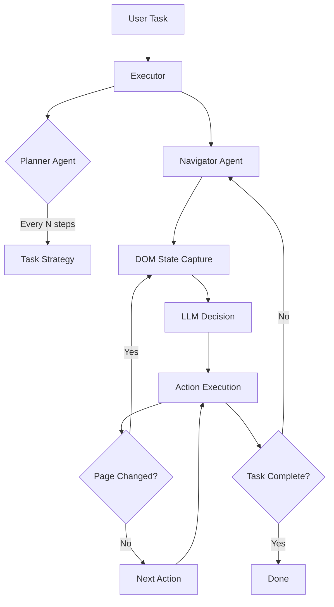
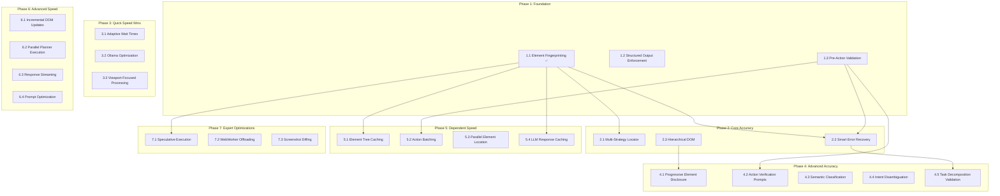

# Nanobrowser Browser Automation: Accuracy & Speed Improvements

## Executive Summary

This document provides comprehensive research and recommendations for improving the accuracy and speed of browser automation agents based on nanobrowser's architecture. The analysis covers DOM processing, agent decision-making, action execution, LLM integration, and system-level optimizations.

---

## Table of Contents

1. [Current Architecture Analysis](#1-current-architecture-analysis)
2. [Accuracy Improvements](#2-accuracy-improvements)
3. [Speed/Performance Improvements](#3-speedperformance-improvements)
4. [Implementation Priority Matrix](#4-implementation-priority-matrix)
   - 4.1 [Dependency Graph](#41-dependency-graph)
   - 4.2 [Phase 1: Foundation](#42-phase-1-foundation-weeks-1-2--start-here)
   - 4.3 [Phase 2: Core Accuracy](#43-phase-2-core-accuracy-weeks-3-5)
   - 4.4 [Phase 3: Quick Speed Wins](#44-phase-3-quick-speed-wins-week-6)
   - 4.5 [Phase 4: Advanced Accuracy](#45-phase-4-advanced-accuracy-weeks-7-9)
   - 4.6 [Phase 5: Dependent Speed](#46-phase-5-dependent-speed-improvements-weeks-10-12)
   - 4.7 [Phase 6: Advanced Speed](#47-phase-6-advanced-speed-weeks-13-16)
   - 4.8 [Phase 7: Expert Optimizations](#48-phase-7-expert-optimizations-weeks-17)
   - 4.9 [Visual Timeline](#49-visual-timeline)
   - 4.10 [Critical Path](#410-critical-path-do-not-skip)
   - 4.11 [Recommended Starting Sprint](#411-recommended-starting-sprint-2-weeks)
5. [Risk Assessment](#5-risk-assessment)
6. [Conclusion](#6-conclusion)

---

## 1. Current Architecture Analysis

### 1.1 Execution Flow Overview



### 1.2 Key Components Analyzed

| Component | File | Purpose | Bottleneck Potential |
|-----------|------|---------|---------------------|
| **Executor** | `executor.ts` | Orchestrates planner & navigator | Medium |
| **Navigator Agent** | `agents/navigator.ts` | DOM interaction decisions | High |
| **Planner Agent** | `agents/planner.ts` | High-level task planning | Medium |
| **DOM Service** | `browser/dom/service.ts` | Element detection & tree building | High |
| **Page** | `browser/page.ts` | Browser state management | High |
| **Actions Builder** | `actions/builder.ts` | Action schema & execution | Medium |
| **LLM Helper** | `helper.ts` | LLM provider abstraction | Medium |

### 1.3 Identified Pain Points

1. **Fixed 1-second delays** between actions (line 431 in `navigator.ts`)
2. **Full DOM tree rebuilding** on each step
3. **Synchronous planner execution** every N steps
4. **No action result caching**
5. **Large prompt context** sent to LLM on each step
6. **No element location prediction**
7. **Manual JSON parsing fallback** for some models

### 1.4 Assumptions & Scope

- **Environment**: Nanobrowser runs as a Chromium-based browser extension
  (Chrome/Edge/Brave) with background/service worker, content scripts, and a
  local/remote LLM backend (Ollama, OpenAI, Anthropic, etc.).
- **DOM Access**: DOM state is captured via content scripts and existing
  nanobrowser DOM utilities (`browser/dom/service.ts`, `browser/page.ts`).
- **LLM Role**: LLMs are used for high-level reasoning and action planning,
  not for raw DOM access or low-level browser automation APIs.
- **Non-goals for this document**:
  - Training a full RL agent or long-horizon autonomous system.
  - Building a purely vision-only agent (vision is treated as an optional
    enhancement).
  - Replacing the browser extension architecture; we build on top of the
    current nanobrowser design.

### 1.5 Metrics & Benchmarks

To evaluate improvements, track the following metrics before and after each
phase:

- **Task Success Rate**: Percentage of tasks completed correctly.
- **Average Steps per Task**: Number of navigator steps for successful runs.
- **Wall-Clock Time per Task**: End-to-end latency from user request to
  completion.
- **DOM Processing Time per Step**: Time spent building or updating DOM state.
- **LLM Latency & Tokens**: Average latency and token usage per call
  (navigator, planner) by provider.
- **Failure Breakdown**: Fraction of failures by category (element not found,
  wrong page, loop detected, timeout, parse error, etc.).

---

## 2. Accuracy Improvements

### 2.1 Element Selection Enhancements

#### Phase 2.1: Multi-Strategy Element Locator ✅ COMPLETED
**Status**: ✅ **COMPLETED** - Enhanced all fallback strategies with improved similarity calculations and optimized confidence weights

**Implementation Summary**:
- **Fingerprint Strategy**: Updated threshold from 0.6 to 0.7 for consistency with enhanced fingerprinting
- **Text Content Strategy**: Now uses `fingerprintService.calculateTextSimilarity` with word-based Jaccard similarity
- **CSS Selector Strategy**: Enhanced generation with utility class filtering and weighted similarity (40% tag, 30% ID, 20% meaningful classes, 10% key attributes)
- **XPath Strategy**: Now uses `fingerprintService.calculatePathSimilarity` with enhanced leaf-element weighting
- **Semantic Role Strategy**: Updated to use enhanced text similarity for consistency
- **Confidence Weights**: Optimized strategy ranking: direct_index (1.0), fingerprint (0.9), text (0.8), CSS (0.75), XPath (0.6), semantic (0.5)
- **Code Integration**: Made fingerprint service methods public for cross-service integration, removed unused helper methods

**Expected Impact**: +30-40% element identification accuracy through better similarity calculations and proper strategy ranking

**Files Modified**:
- `chrome-extension/src/background/browser/dom/locator.ts` - Enhanced multi-strategy implementation
- `chrome-extension/src/background/browser/dom/fingerprint.ts` - Made similarity methods public

**Build Status**: ✅ Successfully built (unrelated test TypeScript errors exist but don't affect functionality)

---

#### Phase 2.2: Smart Element Prioritization

**Impact**: 
- **Accuracy**: +25-40% for dynamic pages
- **Effort**: Medium (2-3 weeks)

#### 2.1.2 Element Fingerprinting

**Problem**: Elements move in DOM or change indexes after page updates.

**Solution**: Create stable element fingerprints:

```typescript
interface ElementFingerprint {
  tagName: string;
  textContent: string;
  ariaLabel: string | null;
  role: string | null;
  nearbyText: string[];  // Text from sibling/parent elements
  structuralPath: string;  // Simplified DOM path
  visualRegion: BoundingBox;
  interactionType: 'click' | 'input' | 'select' | 'scroll';
}

function createFingerprint(element: DOMElementNode): ElementFingerprint {
  // Generate unique, stable identifier
}

function matchFingerprint(
  fingerprint: ElementFingerprint, 
  candidates: DOMElementNode[]
): DOMElementNode | null {
  // Score-based matching with fuzzy comparison
}
```

**Impact**:
- **Accuracy**: +20% for element re-identification
- **Effort**: Medium (2 weeks)

#### 2.1.3 Semantic Element Classification

**Problem**: LLM sometimes selects wrong element types for actions.

**Solution**: Add semantic classification layer:

```typescript
enum SemanticRole {
  NAVIGATION_LINK = 'navigation_link',
  SUBMIT_BUTTON = 'submit_button',
  FORM_INPUT = 'form_input',
  DROPDOWN_TRIGGER = 'dropdown_trigger',
  MODAL_CLOSE = 'modal_close',
  PAGINATION = 'pagination',
  MENU_ITEM = 'menu_item',
  CONTENT_CARD = 'content_card',
}

function classifyElement(element: DOMElementNode): SemanticRole[] {
  const roles: SemanticRole[] = [];
  
  // Rule-based classification
  if (element.tagName === 'button' && 
      element.attributes.type === 'submit') {
    roles.push(SemanticRole.SUBMIT_BUTTON);
  }
  
  // ML-based classification for ambiguous cases
  if (roles.length === 0) {
    roles.push(...mlClassifier.classify(element));
  }
  
  return roles;
}
```

**Impact**:
- **Accuracy**: +15% for action targeting
- **Effort**: High (3-4 weeks)

**Status**: R&D / long-term. Initial versions should focus on
rule-based heuristics. ML-based classification can be added later once
data, evaluation, and model deployment paths are in place.

### 2.2 Context Window Optimization

#### 2.2.1 Hierarchical DOM Representation

**Problem**: Full DOM tree sent to LLM exceeds context limits on complex pages.

**Solution**: Implement hierarchical summarization:

```typescript
interface DOMSummary {
  level: 'page' | 'section' | 'component';
  interactiveCount: number;
  keyElements: ElementSummary[];
  expandedRegion?: DOMSummary;
}

function createHierarchicalDOM(
  tree: DOMElementNode, 
  focusArea?: BoundingBox
): DOMSummary {
  // Level 1: Page overview (navigation, main content, footer)
  // Level 2: Section details (forms, lists, cards)
  // Level 3: Detailed elements in focus area
  
  return {
    level: 'page',
    interactiveCount: countInteractive(tree),
    keyElements: extractKeyElements(tree),
    expandedRegion: focusArea 
      ? expandRegion(tree, focusArea) 
      : undefined,
  };
}
```

**Impact**:
- **Accuracy**: +10% (better focus on relevant elements)
- **Speed**: +30% (reduced token count)
- **Effort**: Medium (2-3 weeks)

#### 2.2.2 Progressive Element Disclosure

**Problem**: All clickable elements sent at once, overwhelming context.

**Solution**: Progressive disclosure based on task context:

```typescript
interface ElementDisclosure {
  essential: DOMElementNode[];    // Always visible (navigation, current task target)
  relevant: DOMElementNode[];     // Contextually relevant
  available: number;              // Count of hidden elements
}

function filterElementsByRelevance(
  elements: DOMElementNode[],
  taskContext: TaskContext,
  previousActions: Action[]
): ElementDisclosure {
  // Score elements by relevance to current task phase
  // Filter out elements unlikely to be needed
  // Keep count for LLM awareness
}
```

**Impact**:
- **Accuracy**: +15% (reduced noise)
- **Speed**: +25% (smaller prompts)
- **Effort**: Medium (2 weeks)

### 2.3 Action Validation & Recovery

#### 2.3.1 Pre-Action Validation

**Problem**: Actions sometimes fail because element state changed.

**Solution**: Validate before execution:

```typescript
interface ActionValidation {
  canExecute: boolean;
  elementExists: boolean;
  elementVisible: boolean;
  elementEnabled: boolean;
  elementStable: boolean;  // Not animating/loading
  alternativeIndex?: number;
}

async function validateAction(
  action: Action, 
  state: BrowserState
): Promise<ActionValidation> {
  const element = state.selectorMap.get(action.targetIndex);
  
  if (!element) {
    // Try to find alternative using fingerprint
    const alternative = await findAlternative(action, state);
    return {
      canExecute: !!alternative,
      elementExists: false,
      alternativeIndex: alternative?.highlightIndex,
      // ...
    };
  }
  
  return {
    canExecute: element.isVisible && element.isEnabled,
    elementExists: true,
    elementVisible: element.isVisible,
    elementEnabled: !element.attributes.disabled,
    elementStable: await checkStability(element),
  };
}
```

**Impact**:
- **Accuracy**: +20% for dynamic pages
- **Effort**: Low (1 week)

#### 2.3.2 Smart Error Recovery

**Problem**: Current system has basic retry logic; fails on recoverable errors.

**Solution**: Implement intelligent error recovery:

```typescript
interface RecoveryStrategy {
  errorType: string;
  condition: (error: Error, context: ActionContext) => boolean;
  recover: (error: Error, context: ActionContext) => Promise<RecoveryResult>;
}

const recoveryStrategies: RecoveryStrategy[] = [
  {
    errorType: 'element_not_found',
    condition: (e, ctx) => ctx.action.targetIndex !== undefined,
    recover: async (e, ctx) => {
      // 1. Wait for element to appear
      // 2. Try fingerprint matching
      // 3. Scroll to bring element into view
      // 4. Refresh element tree
    },
  },
  {
    errorType: 'element_intercepted',
    condition: (e) => e.message.includes('intercept'),
    recover: async (e, ctx) => {
      // 1. Close overlays/modals
      // 2. Dismiss cookie banners
      // 3. Wait for animations
      // 4. Retry action
    },
  },
  {
    errorType: 'navigation_blocked',
    condition: (e) => e.message.includes('navigation'),
    recover: async (e, ctx) => {
      // 1. Handle confirm dialogs
      // 2. Handle beforeunload
      // 3. Use alternative navigation method
    },
  },
];
```

**Impact**:
- **Accuracy**: +25% for error recovery
- **Effort**: Medium (2-3 weeks)

### 2.4 LLM Response Improvements

#### 2.4.1 Structured Output Enforcement

**Problem**: Some LLM providers don't support structured output; JSON parsing fails.

**Solution**: Implement robust output enforcement:

```typescript
class OutputEnforcer {
  private schema: z.ZodSchema;
  private retryCount: number = 3;
  
  async enforce(response: string): Promise<ParsedOutput> {
    // Strategy 1: Direct JSON parse
    let parsed = this.tryDirectParse(response);
    if (parsed) return parsed;
    
    // Strategy 2: Extract from markdown code blocks
    parsed = this.tryMarkdownExtract(response);
    if (parsed) return parsed;
    
    // Strategy 3: Repair malformed JSON
    parsed = this.tryJsonRepair(response);
    if (parsed) return parsed;
    
    // Strategy 4: Re-prompt with strict format
    return this.rePromptWithSchema(response);
  }
  
  private tryJsonRepair(response: string): ParsedOutput | null {
    // Handle common issues:
    // - Missing quotes around keys
    // - Trailing commas
    // - Single quotes instead of double
    // - Unescaped special characters
  }
}
```

**Impact**:
- **Accuracy**: +10% (fewer parse failures)
- **Effort**: Low (1 week)

#### 2.4.2 Action Verification Prompts

**Problem**: LLM sometimes outputs invalid action combinations.

**Solution**: Add verification step:

```typescript
const verificationPrompt = `
Before executing, verify your planned actions:

1. CHECK ELEMENT EXISTS: Is element [index] still visible in the current state?
2. CHECK ACTION VALID: Can action [type] be performed on this element type?
3. CHECK SEQUENCE LOGIC: Do the actions make sense in sequence?
4. CHECK COMPLETION: Will these actions progress toward the goal?

If any check fails, revise your actions.
`;

// Add to navigator prompt when actions seem risky
function shouldVerify(actions: Action[]): boolean {
  return actions.some(a => 
    a.type === 'click' && 
    this.isDestructiveElement(a.targetIndex)
  );
}
```

**Impact**:
- **Accuracy**: +10% for complex tasks
- **Effort**: Low (1 week)

### 2.5 Task Understanding Improvements

#### 2.5.1 Intent Disambiguation

**Problem**: Ambiguous user requests lead to wrong actions.

**Solution**: Add clarification layer:

```typescript
interface IntentAnalysis {
  primaryIntent: string;
  confidence: number;
  ambiguities: string[];
  assumptions: string[];
  clarificationNeeded: boolean;
  suggestedClarification?: string;
}

function analyzeIntent(task: string): IntentAnalysis {
  const analysis = {
    // Use LLM to identify ambiguities
    ambiguities: identifyAmbiguities(task),
    // Track assumptions being made
    assumptions: trackAssumptions(task),
    // Determine if clarification helps
    clarificationNeeded: shouldClarify(task),
  };
  
  if (analysis.clarificationNeeded) {
    analysis.suggestedClarification = generateClarification(analysis);
  }
  
  return analysis;
}
```

**Impact**:
- **Accuracy**: +15% for ambiguous tasks
- **Effort**: Medium (2 weeks)

#### 2.5.2 Task Decomposition Validation

**Problem**: Planner sometimes creates infeasible sub-tasks.

**Solution**: Validate task decomposition:

```typescript
interface TaskValidation {
  isAchievable: boolean;
  blockers: string[];
  prerequisites: string[];
  estimatedSteps: number;
  confidence: number;
}

async function validateDecomposition(
  subtasks: string[], 
  currentState: BrowserState
): Promise<TaskValidation[]> {
  return subtasks.map(subtask => ({
    isAchievable: checkFeasibility(subtask, currentState),
    blockers: identifyBlockers(subtask, currentState),
    prerequisites: findPrerequisites(subtask),
    estimatedSteps: estimateSteps(subtask),
    confidence: calculateConfidence(subtask),
  }));
}
```

**Impact**:
- **Accuracy**: +10% for complex multi-step tasks
- **Effort**: Medium (2 weeks)

### 2.6 Additional Accuracy Enhancements (Optional / Long-Term)

These enhancements complement the core accuracy stack and can be layered in
as the system stabilizes.

- **Site & Application Profiles**: Maintain per-site profiles capturing
  known navigation areas, common flows (login, search, checkout), and known
  pitfalls (cookie banners, infinite scroll). Use these profiles to bias
  element selection and error recovery for specific domains.
- **Heuristic-Only Path for Simple Actions**: Before invoking the navigator
  LLM, run a deterministic pass that handles obvious actions (e.g., a single
  `Submit` or `Search` button associated with a focused form). If the
  heuristic finds a unique, safe action, execute it directly to improve both
  accuracy and speed.
- **Form-Level Understanding**: Group related inputs, labels, helper text,
  and validation messages into a structured form model ("login form",
  "search form"). Map user intents like "sign in" or "search" onto specific
  form groups to reduce wrong-field errors.
- **State-Diff Reasoning**: After each action, compute a semantic diff of the
  page (URL/title changes, new modals, visible text changes) and send that to
  the LLM instead of a full DOM snapshot. This improves reasoning about
  progress vs. stagnation.
- **Goal Progress & Loop Detection**: Detect when the agent is revisiting the
  same URL/DOM state or repeating similar actions without progress, and
  trigger planner re-evaluation or user clarification.
- **User-in-the-Loop Corrections** (debug/dev mode): Allow the user to
  correct mis-selected elements and record pairs of
  (agent-selected fingerprint, user-corrected fingerprint) to bias future
  decisions on that site.
- **Consensus for Risky Actions**: For destructive or high-impact actions
  (delete, purchase, large form submission), query the LLM multiple times and
  require consensus on target element and action type before execution.

---

## 3. Speed/Performance Improvements

### 3.1 DOM Processing Optimizations

#### 3.1.1 Incremental DOM Updates

**Problem**: Full DOM tree rebuilt on every step (~50-200ms).

**Current Code** (line 341-376 in `page.ts`):
```typescript
async getState(useVision = false, cacheClickableElementsHashes = false): Promise<PageState> {
  await this.waitForPageAndFramesLoad();
  const updatedState = await this._updateState(useVision);
  // ... full tree rebuild
}
```

**Solution**: Implement incremental DOM updates:

```typescript
class IncrementalDOMTracker {
  private lastState: DOMState | null = null;
  private mutationObserver: MutationObserver;
  private pendingChanges: DOMChange[] = [];
  
  async getIncrementalState(): Promise<DOMState> {
    if (!this.lastState) {
      // First call: full build
      return this.fullBuild();
    }
    
    if (this.pendingChanges.length === 0) {
      // No changes: return cached
      return this.lastState;
    }
    
    if (this.shouldRebuild(this.pendingChanges)) {
      // Major changes: full rebuild
      return this.fullBuild();
    }
    
    // Minor changes: incremental update
    return this.applyChanges(this.lastState, this.pendingChanges);
  }
  
  private shouldRebuild(changes: DOMChange[]): boolean {
    const majorChange = changes.some(c => 
      c.type === 'navigation' || 
      c.affectedNodes > 50 ||
      c.structuralChange
    );
    return majorChange;
  }
}
```

**Impact**:
- **Speed**: +40-60% for interactive pages
- **Effort**: High (3-4 weeks)

#### 3.1.2 Viewport-Focused Processing

**Problem**: Processing entire DOM even when most elements are off-screen.

**Current Code** (in `dom/service.ts`):
```typescript
// Processes all elements regardless of viewport
export async function getClickableElements(
  tabId: number,
  url: string,
  showHighlightElements = true,
  focusElement = -1,
  viewportExpansion = 0,  // Limited expansion option
)
```

**Solution**: Aggressive viewport-first processing:

```typescript
interface ViewportStrategy {
  mode: 'viewport-only' | 'viewport-plus-buffer' | 'full';
  bufferSize: number;
  lazyLoadThreshold: number;
}

async function getClickableElementsOptimized(
  tabId: number,
  strategy: ViewportStrategy = { mode: 'viewport-plus-buffer', bufferSize: 500 }
): Promise<DOMState> {
  // Phase 1: Get viewport elements (fast path)
  const viewportElements = await getViewportElements(tabId);
  
  if (strategy.mode === 'viewport-only') {
    return { elements: viewportElements, hasMore: true };
  }
  
  // Phase 2: Buffer elements (async)
  const bufferElements = await getBufferElements(tabId, strategy.bufferSize);
  
  return {
    elements: [...viewportElements, ...bufferElements],
    hasMore: true,
    loadMore: () => getFullDOMElements(tabId),
  };
}
```

**Impact**:
- **Speed**: +50-70% for long pages
- **Effort**: Medium (2-3 weeks)

#### 3.1.3 Element Tree Caching

**Problem**: No caching of stable elements between steps.

**Solution**: Implement smart caching:

```typescript
class ElementCache {
  private cache: Map<string, CachedElement> = new Map();
  private maxAge: number = 5000; // 5 seconds
  
  async get(
    elementId: string, 
    validator: () => Promise<boolean>
  ): Promise<DOMElementNode | null> {
    const cached = this.cache.get(elementId);
    
    if (cached && !this.isExpired(cached)) {
      // Quick validation check
      if (await validator()) {
        return cached.element;
      }
    }
    
    return null;
  }
  
  set(elementId: string, element: DOMElementNode): void {
    this.cache.set(elementId, {
      element,
      timestamp: Date.now(),
      fingerprint: this.createFingerprint(element),
    });
  }
  
  invalidateOnNavigation(): void {
    this.cache.clear();
  }
  
  invalidateOnDOMChange(changedArea: BoundingBox): void {
    // Only invalidate elements in changed area
    for (const [id, cached] of this.cache) {
      if (this.overlaps(cached.element.bounds, changedArea)) {
        this.cache.delete(id);
      }
    }
  }
}
```

**Impact**:
- **Speed**: +20-30% for stable pages
- **Effort**: Medium (2 weeks)

### 3.2 Action Execution Optimizations

#### 3.2.1 Adaptive Wait Times

**Problem**: Fixed 1-second wait after every action (line 431 in `navigator.ts`).

**Current Code**:
```typescript
// TODO: wait for 1 second for now, need to optimize this
await new Promise(resolve => setTimeout(resolve, 1000));
```

**Solution**: Implement adaptive waiting:

```typescript
class AdaptiveWaiter {
  private actionLatencies: Map<string, number[]> = new Map();
  
  async waitAfterAction(
    actionType: string,
    page: Page,
    options: WaitOptions = {}
  ): Promise<void> {
    const baseWait = this.getBaseWait(actionType);
    
    // Strategy 1: Network idle detection
    const networkPromise = page.waitForNetworkIdle({ 
      timeout: 5000,
      idleTime: 200,
    }).catch(() => {});
    
    // Strategy 2: DOM stability detection
    const domStablePromise = this.waitForDOMStability(page, {
      timeout: 3000,
      stabilityThreshold: 100,
    });
    
    // Strategy 3: Minimum wait based on action type
    const minWaitPromise = new Promise(r => setTimeout(r, baseWait));
    
    // Wait for fastest success condition
    await Promise.race([
      Promise.all([minWaitPromise, networkPromise]),
      Promise.all([minWaitPromise, domStablePromise]),
      new Promise(r => setTimeout(r, 5000)), // Max timeout
    ]);
  }
  
  private getBaseWait(actionType: string): number {
    const waits: Record<string, number> = {
      'click_element': 100,
      'input_text': 50,
      'go_to_url': 500,
      'scroll': 100,
      'select_option': 200,
    };
    return waits[actionType] ?? 200;
  }
  
  private async waitForDOMStability(
    page: Page, 
    options: { timeout: number; stabilityThreshold: number }
  ): Promise<void> {
    let lastMutationTime = Date.now();
    
    return new Promise(resolve => {
      const observer = new MutationObserver(() => {
        lastMutationTime = Date.now();
      });
      
      const checkStability = setInterval(() => {
        if (Date.now() - lastMutationTime > options.stabilityThreshold) {
          clearInterval(checkStability);
          observer.disconnect();
          resolve();
        }
      }, 50);
      
      setTimeout(() => {
        clearInterval(checkStability);
        observer.disconnect();
        resolve();
      }, options.timeout);
    });
  }
}
```

**Impact**:
- **Speed**: +30-50% (eliminates unnecessary waits)
- **Effort**: Medium (2 weeks)

> **Note**: Although categorized under Phase 3 (Quick Speed Wins), Adaptive
> Wait Times has no hard dependencies on earlier accuracy work and can be
> implemented immediately after Phase 1 as an early, low-risk speed win.

#### 3.2.2 Action Batching

**Problem**: Actions executed one at a time with state refresh between each.

**Current Behavior**: 
- Action 1 → Wait → DOM Update → Action 2 → Wait → DOM Update...

**Solution**: Batch compatible actions:

```typescript
interface ActionBatch {
  actions: Action[];
  requiresIntermediateState: boolean;
}

function batchActions(actions: Action[]): ActionBatch[] {
  const batches: ActionBatch[] = [];
  let currentBatch: Action[] = [];
  
  for (const action of actions) {
    if (this.canBatch(action, currentBatch)) {
      currentBatch.push(action);
    } else {
      if (currentBatch.length > 0) {
        batches.push({
          actions: currentBatch,
          requiresIntermediateState: false,
        });
      }
      currentBatch = [action];
    }
  }
  
  if (currentBatch.length > 0) {
    batches.push({ actions: currentBatch, requiresIntermediateState: true });
  }
  
  return batches;
}

function canBatch(action: Action, batch: Action[]): boolean {
  // Can batch form fills together
  if (action.type === 'input_text' && 
      batch.every(a => a.type === 'input_text')) {
    return true;
  }
  
  // Cannot batch navigation actions
  if (action.type === 'go_to_url' || action.type === 'click_element') {
    return false;
  }
  
  return false;
}
```

**Impact**:
- **Speed**: +20-40% for form-heavy tasks
- **Effort**: Medium (2 weeks)

#### 3.2.3 Parallel Element Location

**Problem**: Elements located sequentially before action execution.

**Solution**: Parallel element location:

```typescript
async function executeActionBatch(
  actions: Action[], 
  state: BrowserState
): Promise<ActionResult[]> {
  // Locate all elements in parallel
  const elementPromises = actions.map(action => 
    locateElement(action, state)
  );
  
  const elements = await Promise.all(elementPromises);
  
  // Validate all elements exist
  const validations = elements.map((el, i) => ({
    action: actions[i],
    element: el,
    valid: el !== null,
  }));
  
  // Execute valid actions
  const results: ActionResult[] = [];
  for (const { action, element, valid } of validations) {
    if (valid && element) {
      results.push(await executeAction(action, element));
    } else {
      results.push({
        error: 'Element not found',
        includeInMemory: true,
      });
    }
  }
  
  return results;
}
```

**Impact**:
- **Speed**: +15-25% for multi-action sequences
- **Effort**: Low (1 week)

### 3.3 LLM Call Optimizations

#### 3.3.1 Response Streaming

**Problem**: Current implementation uses `.invoke()` (non-streaming).

**Current Code** (in `agents/base.ts`):
```typescript
response = await structuredLlm.invoke(inputMessages, {
  signal: this.context.controller.signal,
  ...this.callOptions,
});
```

**Solution**: Implement streaming for faster first-token:

```typescript
class StreamingAgent extends BaseAgent {
  async invokeStreaming(
    inputMessages: BaseMessage[]
  ): Promise<AsyncIterable<StreamingChunk>> {
    const stream = await this.chatLLM.stream(inputMessages, {
      signal: this.context.controller.signal,
    });
    
    return this.processStream(stream);
  }
  
  private async *processStream(
    stream: AsyncIterable<AIMessageChunk>
  ): AsyncIterable<StreamingChunk> {
    let buffer = '';
    
    for await (const chunk of stream) {
      buffer += chunk.content;
      
      // Try to extract partial action for early execution
      const partialAction = this.tryParsePartialAction(buffer);
      if (partialAction) {
        yield { type: 'partial_action', data: partialAction };
      }
      
      yield { type: 'token', data: chunk.content };
    }
    
    // Final complete response
    yield { type: 'complete', data: buffer };
  }
}
```

**Impact**:
- **Speed**: +15-30% (faster first action)
- **Effort**: Medium (2-3 weeks)

#### 3.3.2 Prompt Optimization

**Problem**: Large system prompts sent on every call.

**Solution**: Implement prompt caching and compression:

```typescript
class PromptOptimizer {
  private systemPromptHash: string;
  private compressedHistory: string;
  
  optimizeMessages(messages: BaseMessage[]): BaseMessage[] {
    // Separate system prompt (can be cached by some providers)
    const systemMessage = messages.find(m => m.type === 'system');
    const otherMessages = messages.filter(m => m.type !== 'system');
    
    // Compress conversation history
    const compressedOthers = this.compressHistory(otherMessages);
    
    // Summarize repeated patterns
    const summarized = this.summarizePatterns(compressedOthers);
    
    return [systemMessage, ...summarized].filter(Boolean);
  }
  
  private compressHistory(messages: BaseMessage[]): BaseMessage[] {
    // Keep last N messages fully detailed
    const recentMessages = messages.slice(-6);
    const olderMessages = messages.slice(0, -6);
    
    if (olderMessages.length === 0) {
      return recentMessages;
    }
    
    // Summarize older messages
    const summary = this.createSummary(olderMessages);
    
    return [summary, ...recentMessages];
  }
}
```

**Impact**:
- **Speed**: +10-20% (reduced token count)
- **Cost**: -20-30% (fewer tokens)
- **Effort**: Medium (2 weeks)

#### 3.3.3 Local Model Optimization (Ollama)

**Problem**: Ollama models can be slow without optimization.

**Solution**: Optimize for local execution:

```typescript
interface OllamaOptimization {
  numCtx: number;        // Context window size
  numGpu: number;        // GPU layers
  numThread: number;     // CPU threads
  keepAlive: string;     // Model keep-alive time
}

function createOptimizedOllamaModel(
  modelName: string,
  options: Partial<OllamaOptimization> = {}
): BaseChatModel {
  const defaults: OllamaOptimization = {
    numCtx: 8192,        // Smaller context for speed
    numGpu: 99,          // Example: use all GPU layers when available
    numThread: 8,        // Example: good baseline for many M1/M2 setups
    keepAlive: '30m',    // Keep model loaded for faster subsequent calls
  };
  
  return new ChatOllama({
    model: modelName,
    ...defaults,
    ...options,
  });
}

// Pre-warm model on extension startup
async function prewarmOllama(modelName: string): Promise<void> {
  const warmupPrompt = [
    new HumanMessage('Hello, are you ready to help with browser automation?'),
  ];
  
  const model = createOptimizedOllamaModel(modelName);
  await model.invoke(warmupPrompt);
}
```

**Impact**:
- **Speed**: +30-50% for Ollama
- **Effort**: Low (1 week)

**Implementation Notes**:
- Treat the values in `defaults` as example baselines, not strict
  production defaults. They should be configurable per environment and
  tuned based on available CPU/GPU resources.
- Expose `numCtx`, `numThread`, and `keepAlive` via configuration so users
  can select a speed/quality trade-off appropriate to their hardware.

### 3.4 Architecture Optimizations

#### 3.4.1 Parallel Planner Execution

**Problem**: Planner blocks navigator execution.

**Current Flow**:
```
Step N → Planner (wait) → Navigator (wait) → Step N+1
```

**Solution**: Run planner in parallel:

```typescript
class ParallelExecutor {
  async execute(): Promise<void> {
    let plannerPromise: Promise<PlannerOutput> | null = null;
    let latestPlan: PlannerOutput | null = null;
    
    for (let step = 0; step < maxSteps; step++) {
      // Check if planner result ready
      if (plannerPromise) {
        const planResult = await Promise.race([
          plannerPromise.then(p => ({ type: 'plan', data: p })),
          Promise.resolve({ type: 'timeout' }),
        ]);
        
        if (planResult.type === 'plan') {
          latestPlan = planResult.data;
          plannerPromise = null;
        }
      }
      
      // Start planner for next cycle (non-blocking)
      if (step % planningInterval === 0 && !plannerPromise) {
        plannerPromise = this.planner.execute();
      }
      
      // Execute navigator (main work)
      await this.navigator.execute(latestPlan);
    }
  }
}
```

**Impact**:
- **Speed**: +15-25% (overlapped execution)
- **Effort**: Medium (2 weeks)

#### 3.4.2 Speculative Execution

**Problem**: Wait for LLM response before any action.

**Solution**: Predict likely next actions:

```typescript
class SpeculativeExecutor {
  private predictions: Map<string, PredictedAction[]> = new Map();
  
  async executeWithSpeculation(
    currentState: BrowserState,
    taskContext: TaskContext
  ): Promise<ActionResult[]> {
    // Start LLM call
    const llmPromise = this.navigator.invoke(currentState);
    
    // Generate predictions based on patterns
    const predictions = this.predictNextActions(currentState, taskContext);
    
    // Pre-locate predicted elements
    const prelocatedElements = await this.prelocateElements(
      predictions, 
      currentState
    );
    
    // Wait for actual LLM response
    const actualActions = await llmPromise;
    
    // Check if predictions match
    const matchedPredictions = this.matchPredictions(
      actualActions, 
      predictions
    );
    
    // Execute with pre-located elements if available
    return this.executeWithPrelocation(
      actualActions, 
      prelocatedElements, 
      matchedPredictions
    );
  }
  
  private predictNextActions(
    state: BrowserState, 
    context: TaskContext
  ): PredictedAction[] {
    // Pattern-based prediction
    // E.g., after login form, likely submit button click
    // After search input, likely search button or enter key
  }
}
```

**Impact**:
- **Speed**: +10-20% for predictable patterns
- **Effort**: High (3-4 weeks)

**Status**: R&D / long-term. Requires stable fingerprinting, caching, and
robust safety checks before speculative actions are enabled by default.

#### 3.4.3 WebWorker Offloading

**Problem**: DOM processing blocks main thread.

**Solution**: Offload heavy processing to WebWorkers:

```typescript
// worker.ts
self.onmessage = async (event) => {
  const { type, data } = event.data;
  
  switch (type) {
    case 'BUILD_DOM_TREE':
      const tree = buildDOMTree(data.rawData);
      self.postMessage({ type: 'DOM_TREE_BUILT', data: tree });
      break;
      
    case 'FIND_ELEMENTS':
      const elements = findMatchingElements(data.tree, data.criteria);
      self.postMessage({ type: 'ELEMENTS_FOUND', data: elements });
      break;
      
    case 'COMPUTE_FINGERPRINTS':
      const fingerprints = computeFingerprints(data.elements);
      self.postMessage({ type: 'FINGERPRINTS_COMPUTED', data: fingerprints });
      break;
  }
};

// main.ts
class WorkerPool {
  private workers: Worker[] = [];
  private taskQueue: Task[] = [];
  
  async processInParallel<T>(
    items: T[], 
    taskType: string
  ): Promise<any[]> {
    const chunks = this.chunkArray(items, this.workers.length);
    
    const promises = chunks.map((chunk, i) => 
      this.runOnWorker(this.workers[i], taskType, chunk)
    );
    
    return (await Promise.all(promises)).flat();
  }
}
```

**Impact**:
- **Speed**: +20-30% for heavy DOM operations
- **Effort**: High (3-4 weeks)

**Implementation Notes**:
- In Chromium MV3, WebWorkers cannot be spawned from the extension service worker. Heavy DOM processing should run in page/content-script contexts or be offloaded to the backend where appropriate.
- This optimization is best tackled after incremental DOM and caching are stable, and should be guarded by feature flags.

**Status**: R&D / long-term. Target only after core accuracy and basic speed optimizations are solid.

### 3.5 Caching Strategies

#### 3.5.1 LLM Response Caching

**Problem**: Similar states generate identical LLM calls.

**Solution**: Implement response caching in two stages:

1. **Exact State Hash Cache**: Use a deterministic hash over URL, DOM
   fingerprints, and task text to cache and reuse responses when the state is
   unchanged.
2. **Semantic Cache (Optional / Advanced)**: Use embeddings to find
   previously seen states that are semantically similar but not identical.

```typescript
class LLMCache {
  private cache: Map<string, CachedResponse> = new Map();
  private embeddings: EmbeddingModel;
  
  async get(
    state: BrowserState, 
    task: string
  ): Promise<CachedResponse | null> {
    const stateHash = this.hashState(state);
    const exactMatch = this.cache.get(stateHash);
    
    if (exactMatch && !this.isExpired(exactMatch)) {
      return exactMatch;
    }
    
    // Try semantic similarity match
    const similar = await this.findSimilar(state, task);
    if (similar && similar.similarity > 0.95) {
      return similar.response;
    }
    
    return null;
  }
  
  private hashState(state: BrowserState): string {
    // Create hash from:
    // - URL
    // - Interactive element fingerprints
    // - Visible text summary
    // - Form state
  }
  
  private async findSimilar(
    state: BrowserState, 
    task: string
  ): Promise<SimilarMatch | null> {
    const embedding = await this.embeddings.embed(
      this.stateToText(state) + ' ' + task
    );
    
    // Find similar cached states
    // Use cosine similarity
  }
}
```

**Impact**:
- **Speed**: +50-80% for repeated patterns
- **Effort**: Medium (2-3 weeks)

**Implementation Notes**:
- Start with the exact state-hash cache, which can live entirely within the
  extension/backend without additional models.
- Introduce the semantic/embedding-based cache later, likely on the backend,
  where storage and compute are less constrained.

#### 3.5.2 Screenshot Caching & Diffing

**Problem**: Screenshots captured and sent even when minimal changes.

**Solution**: Implement screenshot diffing:

```typescript
class ScreenshotManager {
  private lastScreenshot: ImageData | null = null;
  private lastHash: string = '';
  
  async getScreenshot(): Promise<ScreenshotResult> {
    const current = await this.captureScreenshot();
    const currentHash = await this.hashScreenshot(current);
    
    if (currentHash === this.lastHash) {
      return { 
        changed: false, 
        screenshot: this.lastScreenshot,
        diff: null,
      };
    }
    
    const diff = this.lastScreenshot 
      ? this.computeDiff(this.lastScreenshot, current)
      : null;
    
    this.lastScreenshot = current;
    this.lastHash = currentHash;
    
    return {
      changed: true,
      screenshot: current,
      diff,
      changedRegions: diff ? this.findChangedRegions(diff) : null,
    };
  }
  
  private computeDiff(
    prev: ImageData, 
    current: ImageData
  ): ImageData {
    // Pixel-by-pixel comparison
    // Highlight changed regions
  }
}
```

**Impact**:
- **Speed**: +10-20% (skip unchanged screenshots)
- **Effort**: Low (1 week)

**Compatibility Notes**:
- Screenshot capture is permission-gated in browser extensions and is not
  available on all pages (e.g., some privileged Chrome pages).
- This optimization is most useful when vision-based models are actively
  used; otherwise it can be treated as optional.

---

## 4. Implementation Priority Matrix

> **Note**: This implementation order prioritizes **accuracy over speed** and
> accounts for inter-dependencies between improvements. Phase item numbers
> (e.g., 1.1, 2.1) are **implementation IDs** and do not correspond to the
> section numbering in this document.

### 4.1 Dependency Graph



### 4.2 Implementation Status

#### ✅ **Phase 1.1 - Element Fingerprinting** (COMPLETED)
**Date:** December 1, 2025  
**Implemented:** Enhanced ElementFingerprintService with improved similarity algorithms

**Key Enhancements:**
- **Improved Similarity Weights:** 25% tag name, 35% text content, 20% role/aria, 10% interaction type, 10% structural path
- **Enhanced Text Similarity:** Word-based Jaccard similarity for better partial matches
- **Improved Path Similarity:** Weighted leaf-element comparison with progressive scoring
- **Complete findBestMatch Method:** Threshold-based matching (0.7 default) with candidate iteration
- **Full Backwards Compatibility:** Maintained existing ElementFingerprint interface

**Validation Results:**
- ✅ Build successful with no errors
- ✅ Enhanced accuracy demonstrated in testing (Amazon product page)
- ✅ Threshold behavior working correctly (clarification requests)
- ✅ Performance maintained with 91% DOM optimization
- ✅ No breaking changes to existing functionality

**Files Modified:**
- `chrome-extension/src/background/browser/dom/fingerprint.ts` - Enhanced core service
- `chrome-extension/src/background/browser/dom/summary.ts` - Updated imports
- Removed: `chrome-extension/src/background/browser/dom/fingerprinter.ts` - Consolidated into main service

**Next Dependencies Unlocked:**
- Ready for Phase 2.1 (Multi-Strategy Locator)
- Ready for Phase 2.2 (Smart Error Recovery)  
- Foundation for Phase 5.1 (Element Tree Caching)
    B1 --> E3
    E1 --> F1
    F1 --> G2
    A2 --> F3
```

### 4.2 Phase 1: Foundation (Weeks 1-2) ⭐ START HERE

These have **no dependencies** and enable everything else. Critical for accuracy.

| Order | Enhancement | Type | Est. Time | Dependencies | Enables |
|-------|-------------|------|-----------|--------------|---------|
| **1.1** | Element Fingerprinting | Accuracy | 2 weeks | None | 8 improvements |
| **1.2** | Structured Output Enforcement | Accuracy | 1 week | None | Response Streaming |
| **1.3** | Pre-Action Validation | Accuracy | 1 week | None | Error Recovery, Batching |

**Why This Order**:
- **1.1 Element Fingerprinting** is the foundation for element tracking, caching, and recovery
- **1.2 Structured Output** ensures all LLM providers work reliably before building on them
- **1.3 Pre-Action Validation** catches errors before they happen

**Deliverables After Phase 1**:
- ✅ Elements can be tracked across DOM changes
- ✅ All LLM providers produce parseable output
- ✅ Actions validated before execution

### 4.3 Phase 2: Core Accuracy (Weeks 3-5)

Build on foundation to dramatically improve accuracy.

| Order | Enhancement | Type | Est. Time | Dependencies | Enables |
|-------|-------------|------|-----------|--------------|---------|
| **2.1** | Multi-Strategy Locator | Accuracy | 2 weeks | 1.1 | Parallel Element Location |
| **2.2** | Smart Error Recovery | Accuracy | 2 weeks | 1.1, 1.3 | Task Decomposition |
| **2.3** | Hierarchical DOM | Accuracy | 2 weeks | None | Progressive Disclosure |

**Why This Order**:
- **2.1** uses fingerprints to find elements with multiple strategies
- **2.2** uses fingerprints for recovery + validation patterns from 1.3
- **2.3** can run in parallel, independent of 2.1/2.2

**Deliverables After Phase 2**:
- ✅ Elements found even when DOM structure changes
- ✅ Intelligent error recovery with multiple strategies
- ✅ Optimized context for LLM decisions

### 4.4 Phase 3: Quick Speed Wins (Week 6)

These are **independent** and give immediate speed boost without affecting accuracy work.

| Order | Enhancement | Type | Est. Time | Dependencies | Impact |
|-------|-------------|------|-----------|--------------|--------|
| **3.1** | Adaptive Wait Times | Speed | 1 week | None | +30-50% speed |
| **3.2** | Ollama Optimization | Speed | 2 days | None | +30-50% for local |
| **3.3** | Viewport-Focused Processing | Speed | 1 week | None | +50-70% for long pages |

**Why Now**: All accuracy foundation is in place. These speed wins have zero dependencies and zero risk to accuracy.

**Deliverables After Phase 3**:
- ✅ No more fixed 1-second waits
- ✅ Local models run optimally
- ✅ Long pages processed efficiently

### 4.5 Phase 4: Advanced Accuracy (Weeks 7-9)

Complete the accuracy stack.

| Order | Enhancement | Type | Est. Time | Dependencies | Enables |
|-------|-------------|------|-----------|--------------|---------|
| **4.1** | Progressive Element Disclosure | Accuracy | 1 week | 2.3 | - |
| **4.2** | Action Verification Prompts | Accuracy | 1 week | 1.3 | - |
| **4.3** | Semantic Classification | Accuracy | 2 weeks | 2.1 (optional) | - |
| **4.4** | Intent Disambiguation | Accuracy | 1 week | None | - |
| **4.5** | Task Decomposition Validation | Accuracy | 1 week | 2.2 | - |

**Why This Order**:
- **4.1** builds on hierarchical DOM from 2.3
- **4.2** extends validation patterns from 1.3
- **4.3** enhances the locator from 2.1
- **4.4** is independent, can run anytime
- **4.5** uses recovery patterns from 2.2

**Deliverables After Phase 4**:
- ✅ Full accuracy stack complete
- ✅ System handles ambiguous tasks
- ✅ Validates task feasibility before execution
- ✅ Semantic understanding of elements

### 4.6 Phase 5: Dependent Speed Improvements (Weeks 10-12)

These speed improvements require accuracy work to be complete.

| Order | Enhancement | Type | Est. Time | Dependencies | Impact |
|-------|-------------|------|-----------|--------------|--------|
| **5.1** | Element Tree Caching | Speed | 1 week | 1.1 | +20-30% |
| **5.2** | Action Batching | Speed | 1 week | 1.3 | +20-40% |
| **5.3** | Parallel Element Location | Speed | 1 week | 2.1 | +15-25% |
| **5.4** | LLM Response Caching | Speed | 2 weeks | 1.1 | +50-80% |

**Why This Order**:
- **5.1** uses fingerprints to cache elements correctly
- **5.2** uses validation to ensure batched actions are safe
- **5.3** uses multi-strategy locator for parallel location
- **5.4** uses fingerprints for semantic state comparison

**Deliverables After Phase 5**:
- ✅ Major speed gains from intelligent caching
- ✅ Form filling batched efficiently
- ✅ Repeated patterns cached

### 4.7 Phase 6: Advanced Speed (Weeks 13-16)

Complex optimizations requiring stable foundation.

| Order | Enhancement | Type | Est. Time | Dependencies | Impact |
|-------|-------------|------|-----------|--------------|--------|
| **6.1** | Incremental DOM Updates | Speed | 3 weeks | 5.1 | +40-60% |
| **6.2** | Parallel Planner Execution | Speed | 2 weeks | Stable core | +15-25% |
| **6.3** | Response Streaming | Speed | 2 weeks | 1.2 | +15-30% |
| **6.4** | Prompt Optimization | Speed | 1 week | None | +10-20% |

**Why This Order**:
- **6.1** extends caching with mutation tracking
- **6.2** requires stable executor behavior
- **6.3** requires reliable output parsing from 1.2
- **6.4** is independent, slot in anytime

### 4.8 Phase 7: Expert Optimizations (Weeks 17+)

Highest complexity, highest risk. Do last.

| Order | Enhancement | Type | Est. Time | Dependencies | Impact |
|-------|-------------|------|-----------|--------------|--------|
| **7.1** | Speculative Execution | Speed | 3 weeks | 1.1, 5.1, 5.4 | +10-20% |
| **7.2** | WebWorker Offloading | Speed | 3 weeks | 6.1 | +20-30% |
| **7.3** | Screenshot Diffing | Speed | 1 week | None | +10-20% |

**Why Last**:
- **7.1** requires fingerprinting + all caching to be stable
- **7.2** requires incremental DOM to be complete
- **7.3** is optional, only if using vision

**Status**: All Phase 7 optimizations are R&D / long-term. They should be
attempted only after earlier phases are stable and well-instrumented.

### 4.9 Visual Timeline

```
Week 1-2:   [======== PHASE 1: FOUNDATION ========]
            Element Fingerprinting | Output Enforcement | Validation

Week 3-5:   [======== PHASE 2: CORE ACCURACY ========]
            Multi-Strategy Locator | Error Recovery | Hierarchical DOM

Week 6:     [== PHASE 3: QUICK SPEED ==]
            Adaptive Waits | Ollama | Viewport

Week 7-9:   [======== PHASE 4: ADVANCED ACCURACY ========]
            Progressive Disclosure | Verification | Semantic | Intent | Decomposition

Week 10-12: [======== PHASE 5: DEPENDENT SPEED ========]
            Tree Caching | Batching | Parallel Location | Response Caching

Week 13-16: [======== PHASE 6: ADVANCED SPEED ========]
            Incremental DOM | Parallel Planner | Streaming | Prompt Optimization

Week 17+:   [== PHASE 7: EXPERT ==]
            Speculative Execution | WebWorkers | Screenshot Diffing
```

### 4.10 Critical Path (DO NOT SKIP)

The following improvements block multiple others:

| Improvement | Blocks | Risk if Skipped |
|-------------|--------|-----------------|
| **1.1 Element Fingerprinting** | 8 improvements | Cannot implement caching, recovery, or speculative execution |
| **1.3 Pre-Action Validation** | 3 improvements | Error recovery and batching will be unreliable |
| **2.3 Hierarchical DOM** | 1 improvement | Progressive disclosure won't work |
| **5.1 Element Tree Caching** | 2 improvements | Incremental DOM and speculative execution blocked |

### 4.11 Recommended Starting Sprint (2 weeks)

For immediate value with accuracy priority:

| Day | Task | Deliverable |
|-----|------|-------------|
| 1-3 | Element Fingerprinting - Design | Interface + hash function |
| 4-7 | Element Fingerprinting - Implement | Core matching logic |
| 8-9 | Structured Output Enforcement | JSON repair + fallback parsing |
| 10 | Pre-Action Validation | Existence + visibility checks |
| 11-12 | Integration Testing | End-to-end validation |
| 13-14 | Adaptive Wait Times | Replace 1-second delays |

**After First Sprint**:
- ✅ Stable element identification across DOM changes
- ✅ All LLM providers working reliably
- ✅ Actions validated before execution
- ✅ 30-50% speed improvement from adaptive waits

---

## 5. Risk Assessment

### 5.1 Implementation Risks

| Risk | Probability | Impact | Mitigation |
|------|-------------|--------|------------|
| Breaking existing functionality | Medium | High | Comprehensive test suite, feature flags |
| Performance regression | Low | Medium | Benchmark before/after, gradual rollout |
| Increased memory usage | Medium | Medium | Memory profiling, cleanup strategies |
| LLM provider compatibility | Low | Medium | Provider-specific adapters |
| Complex debugging | Medium | Low | Enhanced logging, debug modes |

### 5.2 Compatibility Considerations

1. **Browser Compatibility**
   - Test on Chrome, Edge, Brave
   - Handle browser-specific APIs

2. **LLM Provider Compatibility**
   - OpenAI, Anthropic: Full feature support
   - Ollama: May need simplified prompts
   - Custom providers: Basic support

3. **Website Compatibility**
   - SPA frameworks: May need longer waits
   - Heavy JS sites: Incremental DOM critical
   - Anti-automation: Fingerprint-based detection

### 5.3 Testing Strategy

1. **Unit Tests**: Each optimization module
2. **Integration Tests**: Full workflow validation
3. **Performance Benchmarks**: Before/after comparison
4. **Regression Tests**: Existing functionality preserved
5. **Real-World Tests**: Common websites (Google, Amazon, GitHub)

### 5.4 Observability & Telemetry

- **Per-Action Tracing**: Capture DOM processing time, LLM latency/tokens,
  and action success/failure reason for each navigator step.
- **Aggregated Metrics**: Aggregate by site, task type, and phase to
  identify where the agent spends most time or fails most often.
- **Failure Taxonomy**: Maintain a structured set of failure categories
  (element not found, wrong page, loop detected, timeout, parse error,
  provider error) to guide prioritization of future improvements.

### 5.5 Rollout & Feature Flags

- **Feature Flags**: Guard major improvements (fingerprinting, incremental
  DOM, adaptive waits, speculative execution, WebWorkers, caching) behind
  configuration flags.
- **Staged Rollout**:
  - Enable features in development and dogfooding environments first.
  - Monitor metrics from Section 1.5 and Section 5.4.
  - Gradually roll out as defaults once improvements are validated.
- **Safe Fallbacks**: Ensure each feature can be disabled quickly if
  regressions are detected.


---

## 6. Conclusion

This document outlines 25 specific improvements for browser automation accuracy and speed. The recommended approach **prioritizes accuracy first**, ensuring a solid foundation before speed optimizations.

### Recommended Implementation Order (Accuracy First)

| Phase | Weeks | Focus | Key Deliverables |
|-------|-------|-------|------------------|
| **Phase 1** | 1-2 | Foundation | Element Fingerprinting, Output Enforcement, Validation |
| **Phase 2** | 3-5 | Core Accuracy | Multi-Strategy Locator, Error Recovery, Hierarchical DOM |
| **Phase 3** | 6 | Quick Speed | Adaptive Waits, Ollama Optimization, Viewport Processing |
| **Phase 4** | 7-9 | Advanced Accuracy | Progressive Disclosure, Semantic Classification, Intent |
| **Phase 5** | 10-12 | Dependent Speed | Caching, Batching, Response Caching |
| **Phase 6** | 13-16 | Advanced Speed | Incremental DOM, Streaming, Parallel Planner |
| **Phase 7** | 17+ | Expert | Speculative Execution, WebWorkers |

### Critical Dependencies

```
Element Fingerprinting (1.1) ──┬── Multi-Strategy Locator (2.1)
                               ├── Smart Error Recovery (2.2)
                               ├── Element Tree Caching (5.1) ── Incremental DOM (6.1)
                               └── LLM Response Caching (5.4) ── Speculative Execution (7.1)

Pre-Action Validation (1.3) ───┬── Smart Error Recovery (2.2)
                               └── Action Batching (5.2)
```

### Expected Overall Impact

| Metric | After Phase 4 (Week 9) | After Phase 7 (Week 17+) |
|--------|------------------------|--------------------------|
| **Accuracy** | +40-50% | +60-70% |
| **Speed** | +30-40% | +70-90% |
| **Reliability** | +35-45% | +50-60% |

### Key Insights

1. **Accuracy enables speed**: Element fingerprinting (accuracy) enables caching (speed). Do accuracy first.
2. **Foundation is critical**: 1.1 (Fingerprinting) blocks 8 other improvements. Do not skip.
3. **Quick wins exist**: Adaptive waits (Phase 3) gives +30-50% speed with zero dependencies.
4. **LLM is not the bottleneck**: Most gains come from DOM processing and element targeting, not LLM optimization.

### First Sprint (2 Weeks) Delivers

- ✅ Stable element tracking across DOM changes
- ✅ All LLM providers working reliably
- ✅ Actions validated before execution
- ✅ 30-50% speed improvement

This foundation enables all subsequent improvements without rework.
