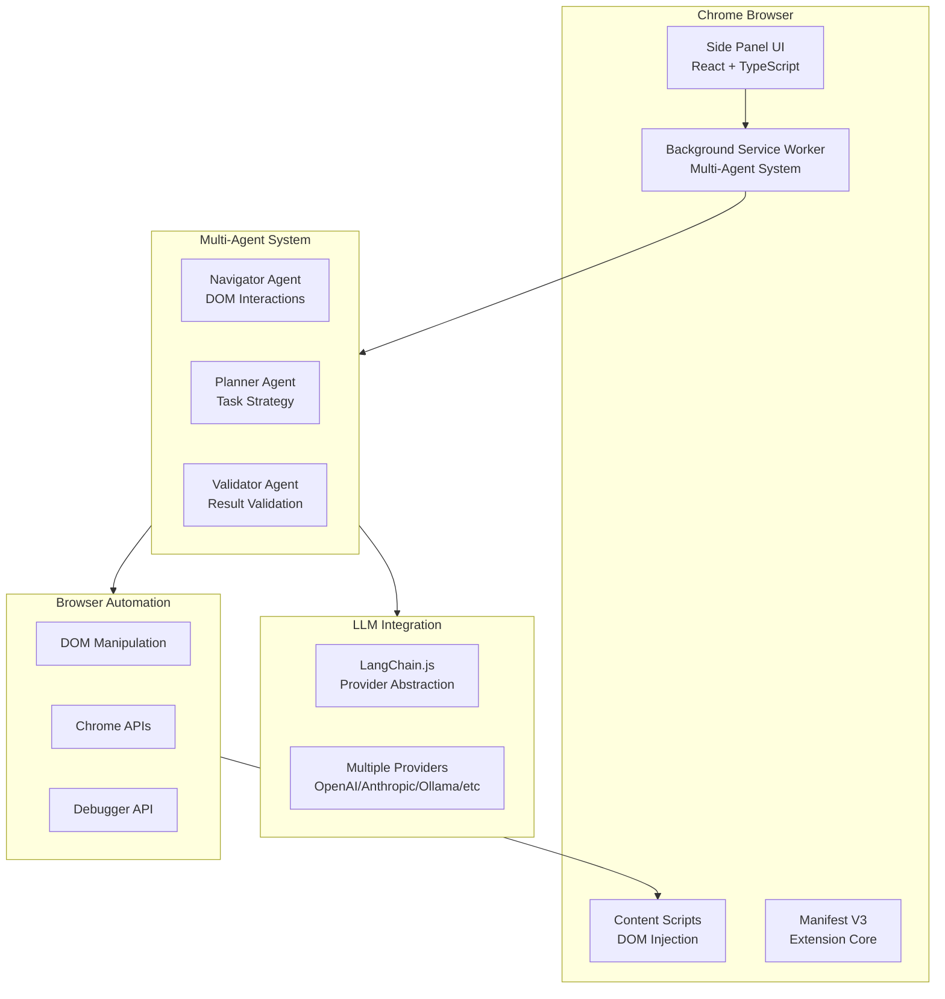
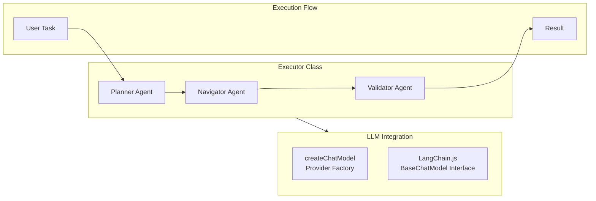

# Nanobrowser Technical Architecture Documentation

## Executive Summary

Nanobrowser is an open-source Chrome extension for AI-powered web automation that runs multi-agent systems locally in the browser. It serves as a free alternative to OpenAI Operator with support for multiple LLM providers (OpenAI, Anthropic, Gemini, Ollama, etc.).

### License
- **License**: Apache License 2.0
- **Commercial Use**: ✅ Allowed
- **Modifications**: ✅ Allowed
- **Distribution**: ✅ Allowed
- **Requirement**: Preserve original license and copyright notices

---

## 1. System Architecture Overview

### 1.1 High-Level Architecture



### 1.2 Technology Stack

| Component | Technology | Purpose |
|-----------|------------|---------|
| **Extension Framework** | Chrome Extension Manifest V3 | Core extension infrastructure |
| **Frontend** | React 18 + TypeScript + Tailwind CSS | User interface and side panel |
| **Build System** | Vite + Turbo + pnpm workspaces | Monorepo build orchestration |
| **LLM Integration** | LangChain.js | Multi-provider LLM abstraction |
| **Browser Automation** | Chrome APIs + Puppeteer-style DOM manipulation | Web page interaction |
| **State Management** | Chrome Extension Storage API | Configuration and history |
| **Testing** | Vitest | Unit testing framework |
| **Code Quality** | ESLint + Prettier + TypeScript | Development standards |

---

## 2. Detailed Component Analysis

### 2.1 Chrome Extension Core

#### 2.1.1 Manifest Structure
- **Dynamic Manifest**: Generated via `manifest.js`
- **Permissions**: Side panel, tabs, storage, debugger, scripting
- **Side Panel**: Default path `side-panel/index.html`
- **Cross-Browser**: Firefox and Opera support via conditional builds

#### 2.1.2 Background Service Worker
- **Location**: `chrome-extension/src/background/index.ts`
- **Architecture**: Event-driven service worker (Manifest V3)
- **Core Responsibilities**:
  - Multi-agent orchestration
  - Browser context management
  - Message routing between components
  - Extension lifecycle management

### 2.2 Multi-Agent System

#### 2.2.1 Agent Architecture



#### 2.2.2 Agent Specifications

| Agent | Responsibility | Key Classes | LLM Usage |
|-------|----------------|-------------|-----------|
| **Navigator** | DOM interactions, web navigation | `NavigatorAgent`, `NavigatorActionRegistry` | Real-time page analysis |
| **Planner** | Task planning, strategy formulation | `PlannerAgent` | High-level task decomposition |
| **Validator** | Result validation, completion checking | Integrated in Executor | Outcome verification |

#### 2.2.3 Execution Flow
1. **Task Reception**: User input via side panel
2. **Planning Phase**: Planner breaks down task into steps
3. **Navigation Phase**: Navigator executes DOM actions
4. **Validation Phase**: Results validated against objectives
5. **Response Generation**: Results formatted and returned to UI

### 2.3 LLM Integration Layer

#### 2.3.1 Provider Abstraction
- **Core Function**: `createChatModel(providerConfig, modelConfig)`
- **Interface**: LangChain.js `BaseChatModel`
- **Providers Supported**:
  - OpenAI (including reasoning models)
  - Anthropic (Claude series)
  - Google Gemini
  - Ollama (local models)
  - Azure OpenAI
  - DeepSeek, Groq, Cerebras
  - OpenRouter, custom OpenAI-compatible APIs

#### 2.3.2 Model Configuration
```typescript
interface ModelConfig {
  provider: ProviderTypeEnum;
  modelName: string;
  parameters?: {
    temperature?: number;
    topP?: number;
  };
  reasoningEffort?: 'none' | 'minimal' | 'low' | 'medium' | 'high';
}
```

#### 2.3.3 Streaming & Response Handling
- **Streaming**: Supported via LangChain.js streaming interfaces
- **Response Transformation**: Custom adapters for non-OpenAI formats
- **Error Handling**: Comprehensive error types and retry logic

### 2.4 Browser Automation System

#### 2.4.1 DOM Manipulation
- **Context Management**: `BrowserContext` class
- **DOM Access**: Chrome Scripting API + Debugger API
- **Element Selection**: CSS selectors + XPath support
- **Action Execution**: Click, type, scroll, navigation

#### 2.4.2 Security Features
- **URL Validation**: Allowed/blocked domain lists
- **Permission Control**: Minimal required permissions
- **Content Security Policy**: Strict CSP compliance
- **Input Sanitization**: XSS prevention measures

---

## 3. Storage and State Management

### 3.1 Storage Architecture
- **Chrome Storage API**: Persistent configuration and history
- **Store Types**:
  - `llmProviderStore`: API keys and model settings
  - `generalSettingsStore`: Extension preferences
  - `chatHistoryStore`: Conversation history
  - `firewallStore`: Security rules

### 3.2 Configuration Management
- **Settings UI**: React-based options page
- **Validation**: Zod schema validation
- **Persistence**: Automatic sync to Chrome storage
- **Default Values**: Comprehensive fallback configurations

---

## 4. User Interface Components

### 4.1 Side Panel Interface
- **Framework**: React 18 + TypeScript
- **Styling**: Tailwind CSS with custom theme
- **Components**: Modular UI components in `packages/ui`
- **Internationalization**: Complete i18n support

### 4.2 Chat Interface
- **Real-time Messaging**: Event-driven communication
- **Streaming Responses**: Live token streaming
- **History Management**: Persistent conversation threads
- **Action Buttons**: Automation controls and settings

---

## 5. Build and Development System

### 5.1 Monorepo Structure
```
nanobrowser/
├── chrome-extension/          # Core extension code
├── pages/                     # UI pages (side-panel, options)
├── packages/                  # Shared utilities
│   ├── storage/              # Chrome storage abstraction
│   ├── ui/                   # React components
│   ├── i18n/                 # Internationalization
│   └── shared/               # Common utilities
└── scripts/                   # Build and utility scripts
```

### 5.2 Build Configuration
- **Package Manager**: pnpm with workspaces
- **Build Orchestration**: Turbo for caching and dependencies
- **Bundling**: Vite for each workspace
- **TypeScript**: Strict configuration across all packages
- **Development**: Hot reload via Vite HMR

---

## 6. Integration Points with FastAPI Backend

### 6.1 Current LLM Integration
- **Direct API Calls**: LangChain.js calls provider APIs directly
- **Local Processing**: All AI logic runs in browser
- **Configuration**: Provider settings stored in Chrome storage

### 6.2 Potential Integration Strategies

#### Option 1: LLM Replacement (Recommended)
1. **Replace `createChatModel()`** to call FastAPI backend
2. **Preserve Agent Logic**: Keep Navigator/Planner/Validator
3. **Backend Integration**: Route LLM calls to `/api/agent/invoke/stream`
4. **Streaming**: Maintain real-time response streaming

#### Option 2: Full Backend Migration
1. **Agent Migration**: Move multi-agent logic to FastAPI
2. **Extension as UI**: Use only browser automation features
3. **API Communication**: All AI requests via backend
4. **Complexity**: Higher integration effort

### 6.3 API Contract Requirements
```typescript
// Expected interface for FastAPI integration
interface FastAPILLMProvider {
  invokeStream(messages: Message[]): AsyncIterable<string>;
  invoke(messages: Message[]): Promise<string>;
  configure(model: string, options: ModelOptions): void;
}
```

---

## 7. Security and Privacy

### 7.1 Security Measures
- **API Key Storage**: Encrypted Chrome storage
- **Domain Validation**: Firewall for allowed/blocked domains
- **Content Security Policy**: Strict CSP headers
- **Input Validation**: Comprehensive sanitization
- **Permission Principle**: Minimal required permissions

### 7.2 Privacy Features
- **Local Processing**: Optional local LLM via Ollama
- **Data Minimization**: Only essential data collection
- **User Control**: Granular privacy settings
- **No Telemetry**: Analytics disabled by default

---

## 8. Update and Maintenance Strategy

### 8.1 Git Integration Strategy

#### Recommended Approach: Git Subtree
```bash
# Add nanobrowser as subtree
git subtree add --prefix=extensions/nanobrowser https://github.com/nanobrowser/nanobrowser.git main --squash

# Pull updates from upstream
git subtree pull --prefix=extensions/nanobrowser https://github.com/nanobrowser/nanobrowser.git main --squash
```

#### Alternative: Fork + Remote
```bash
# Fork to your GitHub account
git remote add upstream https://github.com/nanobrowser/nanobrowser.git
git remote add origin https://github.com/yourusername/nanobrowser-fork.git

# Track changes selectively
git fetch upstream
git cherry-pick <commit-hash>  # Selective updates
```

### 8.2 Update Management
- **Branch Strategy**: Separate branch for nanobrowser integration
- **Conflict Resolution**: Manual merge for modified files
- **Testing**: Comprehensive testing after upstream updates
- **Documentation**: Track custom modifications separately

### 8.3 Customization Tracking
- **Modification Log**: Document all changes from upstream
- **Configuration Overrides**: Separate config for custom settings
- **Build Scripts**: Custom build process for modified version
- **Version Control**: Semantic versioning for custom releases

---

## 9. Performance and Optimization

### 9.1 Performance Characteristics
- **Memory Usage**: Optimized for browser constraints
- **Network Efficiency**: Streaming responses for real-time feel
- **CPU Usage**: Efficient DOM manipulation
- **Storage**: Minimal footprint with smart caching

### 9.2 Optimization Opportunities
- **Bundle Size**: Tree shaking and code splitting
- **Caching**: Aggressive response caching
- **Lazy Loading**: On-demand component loading
- **Background Processing**: Service worker optimization

---

## 10. Testing and Quality Assurance

### 10.1 Testing Framework
- **Unit Tests**: Vitest for business logic
- **Integration Tests**: Chrome extension testing
- **E2E Tests**: Full workflow automation
- **Performance Tests**: Memory and CPU profiling

### 10.2 Quality Metrics
- **Code Coverage**: Target >80% for core logic
- **Type Safety**: Strict TypeScript compliance
- **Lint Standards**: Airbnb style guide enforcement
- **Build Success**: Automated CI/CD pipeline

---

## 11. Deployment and Distribution

### 11.1 Build Process
```bash
# Development build with hot reload
pnpm dev

# Production build
pnpm build

# Distribution package
pnpm zip
```

### 11.2 Distribution Channels
- **Chrome Web Store**: Primary distribution channel
- **Edge Add-ons**: Secondary Microsoft store
- **Firefox Add-ons**: AMO marketplace (if enabled)
- **Direct Distribution**: Unpacked extension for development

---

## 12. Recommendations for Integration

### 12.1 Immediate Actions
1. **Set up Git Subtree**: Establish proper upstream tracking
2. **Create Integration Branch**: Separate development branch
3. **Analyze LLM Layer**: Deep dive into `createChatModel()` function
4. **Design API Contract**: Define FastAPI integration interface

### 12.2 Development Roadmap
1. **Phase 1**: LLM integration replacement (2-3 weeks)
2. **Phase 2**: Backend feature integration (2-3 weeks)
3. **Phase 3**: Custom feature development (3-4 weeks)
4. **Phase 4**: Testing and optimization (1-2 weeks)

### 12.3 Risk Mitigation
- **Upstream Divergence**: Regular sync with main branch
- **Breaking Changes**: Monitor nanobrowser release notes
- **Security Updates**: Prompt security patch application
- **Performance Impact**: Continuous performance monitoring

---

## 13. Conclusion

Nanobrowser provides a robust, well-architected foundation for AI-powered browser automation. Its Apache 2.0 license and modular design make it ideal for customization and integration with existing FastAPI backends. The multi-agent system, comprehensive LLM provider support, and mature browser automation capabilities significantly reduce development time compared to building from scratch.

Key advantages for integration:
- **80% Feature Parity**: Most required features already implemented
- **Mature Architecture**: Proven multi-agent system design
- **Active Development**: Regular updates and improvements
- **Flexible Integration**: Clean separation between UI and LLM layers
- **Professional Quality**: Comprehensive testing and code quality standards

The recommended integration approach preserves nanobrowser's browser automation excellence while leveraging your existing FastAPI backend for AI processing and RAG capabilities.
